# Design Document: Intelligent Auto-Classification and Deep Discovery Search

## Overview

Tài liệu này mô tả thiết kế chi tiết cho 2 tính năng chính của PVCFC RAG v2.0:

1. **Intelligent Auto-Classification**: Hệ thống phân loại tài liệu PDF tự động sử dụng Multimodal AI (Gemini 2.5 Flash) kết hợp với CADLikeGate guardrail hiện có
2. **Deep Discovery Search**: Endpoint tìm kiếm keyword toàn diện sử dụng OpenSearch Aggregation, không giới hạn bởi top_k của RAG

### Design Goals

- Tích hợp seamless với pipeline ingestion hiện tại
- Tận dụng CADLikeGate đã có để đảm bảo P&ID không bị misclassify
- Sử dụng Adaptive Sampling để xử lý tài liệu dài hiệu quả
- Cung cấp fallback mechanism cho low confidence classification
- Hỗ trợ Deep Search không phụ thuộc vào vector similarity

## Architecture

```mermaid
flowchart TB
    subgraph Ingestion["Ingestion Pipeline"]
        PDF[PDF Upload] --> Sampler[Adaptive Page Sampler]
        Sampler --> CADGate[CADLikeGate Guardrail]
        CADGate -->|CAD_score >= 0.55| ForceP&ID[Force P&ID Classification]
        CADGate -->|CAD_score < 0.55| AIClassifier[Gemini 2.5 Flash Classifier]
        AIClassifier -->|confidence >= 0.5| StoreClass[Store Classification]
        AIClassifier -->|confidence < 0.5| Uncategorized[UNCATEGORIZED + NEEDS_REVIEW]
        ForceP&ID --> StoreClass
        Uncategorized --> StoreClass
        StoreClass --> Chunking[Chunking & Embedding]
        Chunking --> OpenSearch[(OpenSearch)]
        Chunking --> Weaviate[(Weaviate)]
    end

    subgraph DeepSearch["Deep Discovery Search"]
        SearchReq[Search Request] --> KeywordQuery[OpenSearch Multi-Match]
        KeywordQuery --> Aggregation[Doc ID Aggregation]
        Aggregation --> FilterApply[Apply Category/DocType Filters]
        FilterApply --> SearchResp[Search Response]
    end

    subgraph UI["Streamlit UI"]
        TreeView[Document Explorer Tree] --> CategoryExpand[Expand Categories]
        CategoryExpand --> DocTypeExpand[Expand Doc Types]
        DocTypeExpand --> FileList[File List]
        
        DeepSearchTab[Deep Search Tab] --> SearchBar[Keyword Search]
        SearchBar --> FilterDropdown[Category/DocType Filters]
        FilterDropdown --> ResultsView[Results by Category]
    end
```



## Components and Interfaces

### 1. AdaptivePageSampler

Module lấy mẫu trang thông minh theo chiến lược Head-Body-Tail.

```python
@dataclass
class SamplingResult:
    """Result of adaptive page sampling"""
    total_pages: int
    sampled_pages: List[int]  # 0-indexed page numbers
    strategy: str  # "all" | "head_body_tail"
    page_images: List[bytes]  # Rendered page images (PNG)

class AdaptivePageSampler:
    """
    Adaptive page sampling for document classification
    
    Strategy:
    - Documents <= 10 pages: Sample all pages
    - Documents > 10 pages: Head(3) + Body(5) + Tail(2) = 10 pages
    """
    
    def __init__(self, max_sample_pages: int = 10, dpi: int = 150):
        self.max_sample_pages = max_sample_pages
        self.dpi = dpi
    
    def sample(self, pdf_path: Path) -> SamplingResult:
        """
        Sample pages from PDF for classification
        
        Args:
            pdf_path: Path to PDF file
            
        Returns:
            SamplingResult with sampled page indices and rendered images
        """
        pass
    
    def _select_head_body_tail(self, total_pages: int) -> List[int]:
        """
        Select pages using Head-Body-Tail strategy
        
        Head: pages 0, 1, 2 (cover, TOC)
        Tail: pages N-2, N-1 (appendix, signatures)
        Body: 5 pages evenly distributed in middle
        """
        pass
```

### 2. DocumentClassifier

Module phân loại tài liệu sử dụng Gemini 2.5 Flash.

```python
@dataclass
class ClassificationResult:
    """Result of document classification"""
    category: str  # ENGINEERING_DESIGN | VENDOR_EQUIPMENT | OPERATIONS_MAINTENANCE | SAFETY_MANAGEMENT | UNCATEGORIZED
    doc_type: str  # Specific document type within category
    confidence: float  # 0.0 to 1.0
    status: str  # "classified" | "needs_review"
    dominant_content: str  # "text" | "drawing" | "mixed"
    page_analysis: List[Dict]  # Per-page content type analysis
    reasoning: Optional[str]  # AI reasoning for classification

class DocumentClassifier:
    """
    AI-powered document classifier using Gemini 2.5 Flash
    
    Features:
    - Multimodal analysis (text + images)
    - Dominant Content Rule for mixed documents
    - Confidence-based fallback to UNCATEGORIZED
    """
    
    def __init__(
        self,
        model_name: str = "gemini-2.5-flash",
        confidence_threshold: float = 0.5
    ):
        self.model_name = model_name
        self.confidence_threshold = confidence_threshold
        self.taxonomy = DocumentTaxonomy()
    
    def classify(
        self,
        page_images: List[bytes],
        filename: str,
        metadata: Optional[Dict] = None
    ) -> ClassificationResult:
        """
        Classify document based on sampled page images
        
        Args:
            page_images: List of page images (PNG bytes)
            filename: Original filename for hints
            metadata: Optional metadata from path
            
        Returns:
            ClassificationResult with category, doc_type, confidence
        """
        pass
    
    def _apply_dominant_content_rule(
        self,
        page_analysis: List[Dict]
    ) -> str:
        """
        Determine dominant content type from page analysis
        
        Returns: "text" | "drawing" | "mixed"
        """
        pass
    
    def _build_classification_prompt(
        self,
        filename: str,
        metadata: Optional[Dict]
    ) -> str:
        """Build prompt for Gemini classification"""
        pass
```

### 3. ClassificationPipeline

Pipeline tích hợp CADLikeGate + AI Classifier.

```python
class ClassificationPipeline:
    """
    Integrated classification pipeline with P&ID guardrail
    
    Flow:
    1. Run CADLikeGate first
    2. If CAD_score >= 0.55: Force P&ID classification
    3. Else: Run AI classification with Gemini
    4. If confidence < 0.5: Mark as UNCATEGORIZED + NEEDS_REVIEW
    """
    
    def __init__(
        self,
        cadlike_gate: CADLikeGate,
        classifier: DocumentClassifier,
        sampler: AdaptivePageSampler
    ):
        self.cadlike_gate = cadlike_gate
        self.classifier = classifier
        self.sampler = sampler
    
    def classify_document(
        self,
        pdf_path: Path,
        doc_metadata: Optional[Dict] = None
    ) -> ClassificationResult:
        """
        Run full classification pipeline
        
        Args:
            pdf_path: Path to PDF file
            doc_metadata: Optional pre-extracted metadata
            
        Returns:
            ClassificationResult
        """
        pass
```

### 4. DeepSearchService

Service tìm kiếm keyword toàn diện.

```python
@dataclass
class DeepSearchResult:
    """Single document result from deep search"""
    doc_id: str
    filename: str
    category: str
    doc_type: str
    occurrence_count: int
    first_page: int
    snippet: Optional[str]

@dataclass
class DeepSearchResponse:
    """Response from deep search endpoint"""
    query: str
    total_documents: int
    results: List[DeepSearchResult]
    results_by_category: Dict[str, List[DeepSearchResult]]

class DeepSearchService:
    """
    Deep Discovery Search using OpenSearch Aggregation
    
    Features:
    - Keyword-based search (no vector similarity)
    - Returns ALL documents containing keyword
    - Aggregation by doc_id for unique documents
    - Optional filtering by category/doc_type
    """
    
    def __init__(self, opensearch_client):
        self.client = opensearch_client
        self.index_name = "rag_chunks"
    
    def search(
        self,
        keyword: str,
        category_filter: Optional[str] = None,
        doc_type_filter: Optional[str] = None,
        max_documents: int = 10000
    ) -> DeepSearchResponse:
        """
        Search for all documents containing keyword
        
        Args:
            keyword: Search keyword
            category_filter: Optional category filter
            doc_type_filter: Optional doc_type filter
            max_documents: Maximum documents to return
            
        Returns:
            DeepSearchResponse with all matching documents
        """
        pass
    
    def _build_aggregation_query(
        self,
        keyword: str,
        filters: Dict
    ) -> Dict:
        """Build OpenSearch aggregation query"""
        pass
```

### 5. API Endpoints

```python
# New router: app/api/routers/search.py

@router.get("/documents")
async def deep_search_documents(
    keyword: str,
    category: Optional[str] = None,
    doc_type: Optional[str] = None,
    max_results: int = 1000
) -> DeepSearchResponse:
    """
    Deep Discovery Search - Find all documents containing keyword
    
    Unlike RAG search, this returns ALL matching documents
    without vector similarity or top_k limitation.
    """
    pass

# New router: app/api/routers/classification.py

@router.post("/classify")
async def classify_document(
    doc_id: str,
    force_reclassify: bool = False
) -> ClassificationResult:
    """
    Trigger classification for a specific document
    """
    pass

@router.get("/taxonomy")
async def get_taxonomy() -> Dict:
    """
    Get document taxonomy structure
    """
    pass

@router.get("/documents/by-category")
async def get_documents_by_category(
    category: Optional[str] = None,
    doc_type: Optional[str] = None,
    status: Optional[str] = None
) -> List[DocumentMetadata]:
    """
    Get documents grouped by category for tree view
    """
    pass
```

## Data Models

### Document Taxonomy

```python
class DocumentTaxonomy:
    """
    4-Category Document Taxonomy for PVCFC
    """
    
    CATEGORIES = {
        "ENGINEERING_DESIGN": {
            "display_name": "Engineering Design",
            "doc_types": ["P&ID", "Drawing", "Technical Data"]
        },
        "VENDOR_EQUIPMENT": {
            "display_name": "Vendor Equipment",
            "doc_types": ["Datasheet", "Material Partlist", "Vendor Manual"]
        },
        "OPERATIONS_MAINTENANCE": {
            "display_name": "Operations & Maintenance",
            "doc_types": [
                "Operation Instruction",
                "Maintenance Instruction", 
                "Maintenance History",
                "Inventory"
            ]
        },
        "SAFETY_MANAGEMENT": {
            "display_name": "Safety Management",
            "doc_types": ["MOC", "RCA", "Pictures"]
        },
        "UNCATEGORIZED": {
            "display_name": "Uncategorized",
            "doc_types": ["Unknown"]
        }
    }
```

### Metadata Schema Update

```python
# OpenSearch mapping update for rag_chunks index
METADATA_MAPPING_UPDATE = {
    "properties": {
        "metadata": {
            "properties": {
                "category": {
                    "type": "keyword"
                },
                "doc_type": {
                    "type": "keyword"
                },
                "classification_status": {
                    "type": "keyword"  # "classified" | "needs_review" | "pending"
                },
                "classification_confidence": {
                    "type": "float"
                },
                "classification_method": {
                    "type": "keyword"  # "cadlike_gate" | "ai_classifier" | "manual"
                }
            }
        }
    }
}

# Weaviate schema update
WEAVIATE_PROPERTY_UPDATE = [
    {
        "name": "category",
        "dataType": ["text"],
        "indexFilterable": True,
        "indexSearchable": False
    },
    {
        "name": "doc_type", 
        "dataType": ["text"],
        "indexFilterable": True,
        "indexSearchable": False
    },
    {
        "name": "classification_status",
        "dataType": ["text"],
        "indexFilterable": True,
        "indexSearchable": False
    }
]
```


## Correctness Properties

*A property is a characteristic or behavior that should hold true across all valid executions of a system-essentially, a formal statement about what the system should do. Properties serve as the bridge between human-readable specifications and machine-verifiable correctness guarantees.*

### Property 1: Taxonomy Category Validation
*For any* classification result, the category field SHALL be one of exactly 5 values: ENGINEERING_DESIGN, VENDOR_EQUIPMENT, OPERATIONS_MAINTENANCE, SAFETY_MANAGEMENT, or UNCATEGORIZED.
**Validates: Requirements 1.1**

### Property 2: Category-DocType Mapping Consistency
*For any* classification result with a valid category, the doc_type SHALL belong to the predefined list for that category (e.g., ENGINEERING_DESIGN only allows P&ID, Drawing, Technical Data).
**Validates: Requirements 1.3**

### Property 3: Classification Output Completeness
*For any* document classification, the result SHALL contain all required fields: category (non-empty string), doc_type (non-empty string), and confidence (float between 0.0 and 1.0).
**Validates: Requirements 1.2, 4.6**

### Property 4: Short Document Full Sampling
*For any* PDF with total_pages <= 10, the sampler SHALL return sampled_pages with length equal to total_pages (all pages sampled).
**Validates: Requirements 2.1**

### Property 5: Long Document Head-Body-Tail Sampling
*For any* PDF with total_pages > 10, the sampler SHALL return exactly 10 sampled_pages where: pages 0,1,2 are included (Head), pages N-2,N-1 are included (Tail), and 5 Body pages are evenly distributed in the middle section.
**Validates: Requirements 2.2, 2.3, 2.4, 2.5**

### Property 6: P&ID Guardrail Enforcement
*For any* document where CADLikeGate returns CAD_score >= 0.55, the classification result SHALL have category="ENGINEERING_DESIGN" and doc_type="P&ID" regardless of AI classifier output.
**Validates: Requirements 3.1**

### Property 7: Guardrail Execution Order
*For any* document classification, CADLikeGate SHALL be evaluated first, and if CAD_score >= 0.55, the AI classifier SHALL NOT be invoked.
**Validates: Requirements 3.2, 3.3**

### Property 8: AI Classifier Invocation
*For any* document where CADLikeGate returns CAD_score < 0.55, the AI classifier (Gemini 2.5 Flash) SHALL be invoked for classification.
**Validates: Requirements 4.1**

### Property 9: Dominant Content Rule
*For any* page analysis where one content type (text or drawing) appears in more than 50% of sampled pages, the classification SHALL favor document types associated with that dominant content type.
**Validates: Requirements 4.3, 4.4, 4.5**

### Property 10: Low Confidence Fallback
*For any* AI classification result where confidence < 0.5 OR dominant content cannot be determined, the final result SHALL have category="UNCATEGORIZED" and status="NEEDS_REVIEW".
**Validates: Requirements 4.7**

### Property 11: Deep Search Completeness
*For any* keyword search, the result SHALL contain all unique documents in the index that contain the keyword, with no duplicates (unique doc_ids).
**Validates: Requirements 5.2, 5.4**

### Property 12: Deep Search No-LLM Constraint
*For any* deep search request, the system SHALL NOT invoke any LLM or vector similarity search; only keyword-based OpenSearch queries are allowed.
**Validates: Requirements 5.6**

### Property 13: Search Result Metadata
*For any* document in deep search results, the result SHALL include: doc_id, filename, category, doc_type, and occurrence_count (all non-null).
**Validates: Requirements 5.7**

### Property 14: Filter Correctness
*For any* deep search with category_filter or doc_type_filter applied, all returned documents SHALL match the specified filter criteria.
**Validates: Requirements 6.1, 6.2, 6.3**

### Property 15: Result Grouping
*For any* deep search response, results_by_category SHALL contain all results grouped by their category, with no document appearing in multiple category groups.
**Validates: Requirements 6.4**

### Property 16: Pipeline Auto-Classification
*For any* PDF ingested through the pipeline, classification SHALL be automatically triggered and completed before chunking/embedding.
**Validates: Requirements 8.1**

### Property 17: Metadata Persistence
*For any* successfully classified document, the classification metadata (category, doc_type, classification_status) SHALL be persisted in both OpenSearch and Weaviate.
**Validates: Requirements 8.2**

### Property 18: Classification Failure Handling
*For any* document where classification throws an exception, the document SHALL be marked with status="needs_review" and ingestion SHALL continue without blocking.
**Validates: Requirements 8.4**

## Error Handling

### Classification Errors

| Error Type | Handling Strategy | Status |
|------------|-------------------|--------|
| PDF read failure | Log error, mark as needs_review | needs_review |
| Gemini API timeout | Retry 2x with exponential backoff, then fallback | needs_review |
| Gemini API error | Log error, mark as needs_review | needs_review |
| Invalid taxonomy response | Parse error, mark as needs_review | needs_review |
| CADLikeGate exception | Skip guardrail, proceed to AI classifier | classified |

### Deep Search Errors

| Error Type | Handling Strategy | Response |
|------------|-------------------|----------|
| OpenSearch connection failure | Return 503 Service Unavailable | Error response |
| Invalid keyword (empty) | Return 400 Bad Request | Validation error |
| Query timeout | Return partial results with warning | Partial response |
| Index not found | Return 503 with setup instructions | Error response |

### Graceful Degradation

```python
class ClassificationFallback:
    """
    Fallback strategies for classification failures
    """
    
    @staticmethod
    def on_gemini_failure(pdf_path: Path, error: Exception) -> ClassificationResult:
        """Fallback when Gemini API fails"""
        return ClassificationResult(
            category="UNCATEGORIZED",
            doc_type="Unknown",
            confidence=0.0,
            status="needs_review",
            dominant_content="unknown",
            page_analysis=[],
            reasoning=f"Classification failed: {str(error)}"
        )
    
    @staticmethod
    def on_low_confidence(result: ClassificationResult) -> ClassificationResult:
        """Override low confidence results"""
        if result.confidence < 0.5:
            return ClassificationResult(
                category="UNCATEGORIZED",
                doc_type="Unknown",
                confidence=result.confidence,
                status="needs_review",
                dominant_content=result.dominant_content,
                page_analysis=result.page_analysis,
                reasoning=f"Low confidence ({result.confidence:.2f}): {result.reasoning}"
            )
        return result
```

## Testing Strategy

### Dual Testing Approach

This feature requires both unit tests and property-based tests:

1. **Unit Tests**: Verify specific examples, edge cases, and integration points
2. **Property-Based Tests**: Verify universal properties hold across all valid inputs

### Property-Based Testing Framework

- **Framework**: Hypothesis (Python)
- **Minimum iterations**: 100 per property
- **Annotation format**: `# **Feature: intelligent-classification-deep-search, Property {N}: {description}**`

### Unit Test Coverage

| Component | Test Focus |
|-----------|------------|
| AdaptivePageSampler | Edge cases: 1 page, 10 pages, 11 pages, 100 pages |
| DocumentClassifier | Gemini response parsing, taxonomy mapping |
| ClassificationPipeline | CADLikeGate integration, fallback logic |
| DeepSearchService | Query building, aggregation parsing |
| API Endpoints | Request validation, response format |

### Property-Based Test Coverage

| Property | Generator Strategy |
|----------|-------------------|
| Property 1-3 | Generate random ClassificationResult objects |
| Property 4-5 | Generate PDFs with varying page counts (1-200) |
| Property 6-8 | Generate documents with varying CAD_scores (0.0-1.0) |
| Property 9 | Generate page analyses with different content distributions |
| Property 10 | Generate classification results with varying confidence (0.0-1.0) |
| Property 11-15 | Generate test documents with known keywords, categories |
| Property 16-18 | Generate PDF ingestion scenarios with success/failure cases |

### Test Data Generation

```python
from hypothesis import given, strategies as st

# Strategy for generating valid categories
category_strategy = st.sampled_from([
    "ENGINEERING_DESIGN", "VENDOR_EQUIPMENT", 
    "OPERATIONS_MAINTENANCE", "SAFETY_MANAGEMENT", "UNCATEGORIZED"
])

# Strategy for generating page counts
page_count_strategy = st.integers(min_value=1, max_value=500)

# Strategy for generating CAD scores
cad_score_strategy = st.floats(min_value=0.0, max_value=1.0)

# Strategy for generating confidence scores
confidence_strategy = st.floats(min_value=0.0, max_value=1.0)

# Strategy for generating page content types
content_type_strategy = st.sampled_from(["text", "drawing", "mixed"])
```

### Integration Test Scenarios

1. **End-to-end Classification**: Upload PDF → Classification → Metadata stored
2. **P&ID Guardrail**: Upload P&ID → CADLikeGate triggers → Force P&ID classification
3. **Low Confidence Handling**: Upload ambiguous doc → Low confidence → UNCATEGORIZED
4. **Deep Search**: Ingest docs → Search keyword → All matching docs returned
5. **Filter Application**: Search with filters → Only matching docs returned

### Test Environment

- Mock Gemini API responses for deterministic testing
- Use test OpenSearch index with known data
- Generate synthetic PDFs with controlled content
