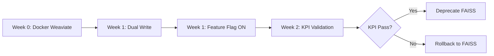

# 📋 WEAVIATE MIGRATION - READINESS REVIEW & ACTION PLAN

**Ngày:** 2025-10-10
**Trạng thái:** ⚠️ **CẦN XỬ LÝ VẤN ĐỀ TRƯỚC KHI TRIỂN KHAI**
**Reviewer:** AI Assistant
**Scope:** Đánh giá toàn diện kế hoạch migration FAISS → Weaviate + BGE Reranker v2-m3

---

## 🎯 TÓM TẮT ĐÁNH GIÁ

### ✅ **Kế hoạch CÓ THỂ TRIỂN KHAI** nhưng cần xử lý:
1. ⚠️ **VẤN ĐỀ NGHIÊM TRỌNG:** Ingestion pipeline bỏ sót documents
2. ⚠️ **Metadata thiếu:** Cần bổ sung schema cho domain prefilter
3. ℹ️ **Làm rõ:** Chi tiết triển khai cần cụ thể hóa

### 📊 **Điểm số tổng quan:**
- **Kiến trúc thiết kế:** 9/10 ⭐
- **Migration strategy:** 8/10 ⭐
- **Tính khả thi kỹ thuật:** 9/10 ⭐
- **Độ sẵn sàng triển khai:** 6/10 ⚠️ (do vấn đề ingestion)

---

## ✅ ĐIỂM MẠNH CỦA KẾ HOẠCH

### 1. **Kiến trúc rõ ràng & phù hợp**

#### a) **Thay đổi tối thiểu, rủi ro thấp**
```
GIỮ NGUYÊN:
✅ Gemini embedding 768d (không cần re-embed toàn bộ corpus)
✅ BM25 hiện tại (có thể chuyển sang Weaviate hybrid sau)
✅ Per-chunk indexing (không tạo page-level index phức tạp)

THAY ĐỔI:
🔄 FAISS → Weaviate (chỉ vector store, không đổi model)
➕ BGE v2-m3 reranker (doc-level + page-level)
➕ JSON-with-evidence + CiteFix
```

**✅ Ưu điểm:**
- Tách biệt rõ ràng giữa embedding model và vector storage
- Có thể rollback nhanh nếu cần
- Không phải train lại model
- Metadata filter built-in trong Weaviate

---

### 2. **Migration Strategy An Toàn**



**✅ Điểm mạnh:**
- Dual-write FAISS + Weaviate song song (giảm rủi ro)
- Feature flag `PRIMARY_RETRIEVER=weaviate` cho phép switch tức thì
- KPI rõ ràng: Citation@Doc≥0.9, @Page≥0.8, MRR@10 +20%
- Có backout plan cụ thể

---

### 3. **BGE v2-m3 Reranker - Lựa chọn đúng**

**So sánh với reranker hiện tại:**
```python
# Hiện tại: cross-encoder/ms-marco-MiniLM-L-6-v2
- Model size: ~90MB
- Max length: 512 tokens
- Performance: Good cho general domain
- Multilingual: No (English only)

# BGE v2-m3: BAAI/bge-reranker-v2-m3
- Model size: ~1.5GB
- Max length: 8192 tokens (dùng 1024 để tối ưu)
- Performance: SOTA cho cross-domain
- Multilingual: Yes (100+ languages, bao gồm Vietnamese)
- Normalize: sigmoid → [0,1] (dễ interpret)
```

**✅ Phù hợp RTX 4060:**
- FP16: ~750MB VRAM cho model
- Batch 8-16: ~2-3GB total VRAM
- Còn đủ cho PaddleOCR (1-2GB)

---

### 4. **Page-Level Rerank + MMR - Thiết kế tốt**

```python
# Pipeline:
1. Doc-level candidates (K_doc=160-220)
   ↓
2. BGE rerank → top-K_doc
   ↓
3. Group by (doc_id, page) → K_page candidates
   ↓
4. OCR chỉ K_page (không OCR toàn bộ corpus)
   ↓
5. BGE page-level rerank
   ↓
6. MMR select M_final pages (λ≈0.4)
   ↓
7. LLM → JSON-with-evidence
```

**✅ Ưu điểm:**
- OCR on-demand (tiết kiệm latency)
- MMR giảm redundancy (không 5 trang giống nhau)
- Page-level dynamic từ chunks (không cần build page index)

---

## ⚠️ VẤN ĐỀ CẦN XỬ LÝ NGAY

### **🚨 CRITICAL: Ingestion Pipeline Bỏ Sót Documents**

#### **Hiện trạng:**
```json
// File CÓ trong doc_id_map.json (line 5):
"DOCID_K06101_CO2_COMPRESSOR_HITACHI_..._1be298a4":
  "D:\\Data_Raw\\...\\002_3N4-S4274343 datasheet for K06101_Rev.02.pdf"

// Nhưng KHÔNG CÓ trong BM25 index metadata.json
// → Không được index
// → Không xuất hiện trong retrieval
// → LLM không thể cite đúng nguồn
```

#### **Root Cause (từ conversation trước):**
> *"File `002_3N4-S4274343` **có trong master `doc_id_map.json`** nhưng **không có trong BM25/FAISS indexes**. This file contains the correct answer on page 3, but retrieval system cannot find it because it's not indexed."*

#### **Impact:**
```
Query: "What is the 4th stage discharge pressure?"
Correct answer: 79.5 bar.a (from 002_3N4-S4274343, page 3)

Current behavior:
❌ Retrieval không tìm thấy 002_3N4-S4274343 (vì chưa index)
❌ Trả về turbine datasheet (wrong domain)
✅ LLM trả lời đúng 79.5 bar.a (từ turbine doc, tình cờ trùng)
❌ Citation sai (cite turbine thay vì compressor)
```

#### **🔧 HÀNH ĐỘNG BẮT BUỘC:**

**Priority 0 - BEFORE migration:**
```bash
# 1. Audit ingestion pipeline
python tools/audit_ingestion_coverage.py \
  --doc-id-map artifacts/ingestion_production/doc_id_map.json \
  --bm25-metadata artifacts/index/bm25/metadata.json \
  --faiss-metadata artifacts/index/faiss/metadatas.json \
  --output reports/ingestion_gap_analysis.json

# 2. Re-ingest missing documents
python tools/ingest_v1.py \
  --mode incremental \
  --only-missing \
  --source artifacts/ingestion_production/doc_id_map.json \
  --output artifacts/ingestion_production

# 3. Rebuild indexes with ALL documents
python build_indices_safe.py \
  --artifacts artifacts/ingestion_production \
  --output artifacts/index \
  --verify-coverage

# 4. Verify fix
python tools/verify_document_coverage.py \
  --doc-id DOCID_K06101_CO2_COMPRESSOR_HITACHI_..._1be298a4 \
  --check-bm25 \
  --check-faiss
```

**Estimated time:** 2-4 hours (depending on corpus size)

**DoD (Definition of Done):**
- [ ] 100% documents trong `doc_id_map.json` có mặt trong BM25 index
- [ ] 100% documents trong `doc_id_map.json` có mặt trong FAISS index
- [ ] Query "4th stage discharge pressure" cite đúng `002_3N4-S4274343 page 3`
- [ ] Audit report không còn gaps

---

### **⚠️ Metadata Schema Thiếu - Cần Bổ Sung**

Kế hoạch yêu cầu **domain prefilter** nhưng metadata hiện tại chưa đủ:

#### **Required metadata (theo BUILD_PLAN):**
```python
# Weaviate schema properties:
properties = {
    "text": "string",
    "doc_id": "string",
    "page": "int",
    "equipment_type": "string",     # ⚠️ Thiếu
    "doc_type": "string",           # ⚠️ Thiếu
    "equipment_id": "string",       # ⚠️ Thiếu
    "vendor": "string",             # ⚠️ Thiếu (optional)
    "source_path": "string",        # ✅ Có
    "lang": "string"                # ⚠️ Thiếu (optional)
}
```

#### **Hiện trạng BM25 metadata:**
```python
# artifacts/index/bm25/metadata.json
{
  "chunk_id": "...",
  "text": "...",
  "doc_id": "...",
  "page": 3,
  "source_path": "..."
  # ❌ Thiếu equipment_type, doc_type, equipment_id
}
```

#### **🔧 HÀNH ĐỘNG:**

**Option 1: Rule-based extraction (nhanh, khuyến nghị)**
```python
# tools/extract_metadata_from_path.py
def extract_equipment_metadata(source_path: str, doc_id: str) -> dict:
    """
    Extract metadata from file path and doc_id.

    Examples:
    - Path: "K06101_CO2 COMPRESSOR_HITACHI/Data/002_3N4-S4274343..."
      → equipment_type: "compressor"
      → equipment_id: "K06101"
      → doc_type: "datasheet"
      → vendor: "HITACHI"

    - Path: "KT06101_TURBINE_HTC/Data/07087-CP22-KT06101..."
      → equipment_type: "turbine"
      → equipment_id: "KT06101"
      → doc_type: "datasheet"
      → vendor: "HTC"
    """
    metadata = {}

    # Equipment type từ path
    if "COMPRESSOR" in source_path.upper():
        metadata["equipment_type"] = "compressor"
    elif "TURBINE" in source_path.upper():
        metadata["equipment_type"] = "turbine"
    elif "PUMP" in source_path.upper():
        metadata["equipment_type"] = "pump"
    # ... thêm patterns

    # Equipment ID từ filename pattern
    match = re.search(r'(K\d{5}|KT\d{5}|P\d{5})', source_path)
    if match:
        metadata["equipment_id"] = match.group(1)

    # Doc type từ folder/filename
    if "/Data/" in source_path or "datasheet" in source_path.lower():
        metadata["doc_type"] = "datasheet"
    elif "/Manual/" in source_path:
        metadata["doc_type"] = "manual"
    elif "/Drawing/" in source_path:
        metadata["doc_type"] = "drawing"
    elif "P&ID" in source_path or "PID" in source_path:
        metadata["doc_type"] = "pid"

    # Vendor từ path
    vendors = ["HITACHI", "HTC", "SIEMENS", "ABB"]
    for v in vendors:
        if v in source_path.upper():
            metadata["vendor"] = v
            break

    return metadata

# Apply to all documents
for doc_id, source_path in doc_id_map.items():
    metadata = extract_equipment_metadata(source_path, doc_id)
    update_document_metadata(doc_id, metadata)
```

**Option 2: LLM-based classification (chính xác hơn, chậm hơn)**
```python
# Dùng Gemini Flash để classify từ 1-3 trang đầu
# (Chỉ khi rule-based không đủ confidence)
```

**Timeline:**
- Rule-based: 1-2 hours
- Re-ingest với metadata mới: 2-4 hours
- Rebuild indexes: 1-2 hours
- **Total:** 4-8 hours

---

### **ℹ️ Cần Làm Rõ Chi Tiết Triển Khai**

#### **1. Weaviate Schema Creation Script**

Kế hoạch chưa có script cụ thể. Đề xuất:

```python
# tools/weaviate_setup.py
import weaviate
from weaviate.classes.config import Configure, Property, DataType

def create_chunk_collection():
    """Create Chunk collection in Weaviate with proper schema."""

    client = weaviate.connect_to_local(
        host="localhost",
        port=8080
    )

    try:
        # Delete if exists (dev only)
        if client.collections.exists("Chunk"):
            client.collections.delete("Chunk")

        # Create collection
        client.collections.create(
            name="Chunk",
            vectorizer_config=Configure.Vectorizer.none(),  # Manual vectors
            vector_index_config=Configure.VectorIndex.hnsw(
                distance_metric=weaviate.classes.config.VectorDistances.COSINE,
                ef_construction=128,
                ef=64,
                max_connections=64
            ),
            properties=[
                Property(name="text", data_type=DataType.TEXT),
                Property(name="doc_id", data_type=DataType.TEXT),
                Property(name="page", data_type=DataType.INT),
                Property(name="chunk_id", data_type=DataType.TEXT),
                Property(name="equipment_type", data_type=DataType.TEXT),
                Property(name="doc_type", data_type=DataType.TEXT),
                Property(name="equipment_id", data_type=DataType.TEXT),
                Property(name="vendor", data_type=DataType.TEXT),
                Property(name="source_path", data_type=DataType.TEXT),
                Property(name="lang", data_type=DataType.TEXT)
            ]
        )

        print("✅ Chunk collection created successfully")

        # Create indexes for filter fields
        # (Weaviate auto-indexes all properties, but we can tune if needed)

    finally:
        client.close()

if __name__ == "__main__":
    create_chunk_collection()
```

**Usage:**
```bash
# After docker compose up
python tools/weaviate_setup.py
```

---

#### **2. Ingestion Script với Weaviate**

```python
# tools/ingest_to_weaviate.py
import weaviate
from app.services.embedding_enhanced import EmbeddingService
from tqdm import tqdm

def ingest_chunks_to_weaviate(
    chunks_file: str,
    weaviate_url: str = "http://localhost:8080"
):
    """Ingest chunks to Weaviate with embeddings."""

    client = weaviate.connect_to_local()
    collection = client.collections.get("Chunk")
    embedding_service = EmbeddingService()

    # Load chunks from JSONL
    with open(chunks_file) as f:
        chunks = [json.loads(line) for line in f]

    # Batch insert
    with collection.batch.dynamic() as batch:
        for chunk in tqdm(chunks, desc="Ingesting to Weaviate"):
            # Get embedding
            embedding = embedding_service.embed_text(chunk["text"])

            # Prepare properties
            props = {
                "text": chunk["text"],
                "doc_id": chunk["doc_id"],
                "page": chunk["page"],
                "chunk_id": chunk["chunk_id"],
                "equipment_type": chunk.get("equipment_type"),
                "doc_type": chunk.get("doc_type"),
                "equipment_id": chunk.get("equipment_id"),
                "vendor": chunk.get("vendor"),
                "source_path": chunk.get("source_path"),
                "lang": chunk.get("lang", "vi")
            }

            # Insert
            batch.add_object(
                properties=props,
                vector=embedding
            )

    print(f"✅ Ingested {len(chunks)} chunks to Weaviate")
    client.close()
```

---

#### **3. Feature Flag Implementation**

```python
# app/core/config.py
class Settings(BaseSettings):
    # Existing...

    # Weaviate migration
    PRIMARY_RETRIEVER: str = "faiss"  # "faiss" | "weaviate"
    WEAVIATE_URL: str = "http://localhost:8080"
    WEAVIATE_COLLECTION: str = "Chunk"

    # Dual write during migration
    DUAL_WRITE_ENABLED: bool = False


# app/deps/indices.py
def get_retriever_dependency() -> HybridRetriever:
    """Get retriever based on feature flag."""
    settings = Settings()

    if settings.PRIMARY_RETRIEVER == "weaviate":
        return create_weaviate_retriever(
            weaviate_url=settings.WEAVIATE_URL,
            collection=settings.WEAVIATE_COLLECTION,
            bm25_dir=str(bm25_path)
        )
    else:
        # Fallback to FAISS
        return create_hybrid_retriever(
            bm25_dir=str(bm25_path),
            faiss_dir=str(faiss_path)
        )
```

**Environment variables:**
```bash
# .env
PRIMARY_RETRIEVER=weaviate
WEAVIATE_URL=http://localhost:8080
DUAL_WRITE_ENABLED=true  # Week 1 only
```

---

## 📋 CHECKLIST TRƯỚC KHI BẮT ĐẦU MIGRATION

### **Phase 0: Fix Existing Issues (MUST DO FIRST)**

- [ ] **P0.1: Audit ingestion coverage**
  - Script: `tools/audit_ingestion_coverage.py`
  - Expected: Report showing gaps between doc_id_map and indexes

- [ ] **P0.2: Re-ingest missing documents**
  - Script: `tools/ingest_v1.py --only-missing`
  - Verify: `002_3N4-S4274343` có trong chunks

- [ ] **P0.3: Extract metadata (equipment_type, doc_type, etc.)**
  - Script: `tools/extract_metadata_from_path.py`
  - Verify: Mỗi chunk có đủ metadata fields

- [ ] **P0.4: Rebuild BM25 + FAISS indexes**
  - Script: `build_indices_safe.py`
  - Verify: 100% coverage

- [ ] **P0.5: Baseline test**
  - Query: "What is the 4th stage discharge pressure for K06101?"
  - Expected: Cite `002_3N4-S4274343 page 3`
  - Current baseline KPI: Document for comparison

**Estimated time:** 1-2 days (8-16 hours)

---

### **Phase 1: Weaviate Setup (Week 1, Days 1-3)**

- [ ] **P1.1: Docker Weaviate setup**
  ```bash
  # docker-compose.yml already exists (needs update)
  docker compose -f docker-compose-weaviate.yml up -d
  curl http://localhost:8080/v1/.well-known/ready
  ```

- [ ] **P1.2: Create Chunk collection**
  ```bash
  python tools/weaviate_setup.py
  ```

- [ ] **P1.3: Dual-write ingest**
  ```bash
  # Ingest to both FAISS and Weaviate
  export DUAL_WRITE_ENABLED=true
  python tools/ingest_to_weaviate.py \
    --chunks artifacts/ingestion_production/chunks.jsonl \
    --verify-dual-write
  ```

- [ ] **P1.4: Verification**
  - BM25 count == FAISS count == Weaviate count
  - Spot check: 10 random doc_ids present in all 3 systems

**Estimated time:** 1-2 days

---

### **Phase 2: BGE Reranker + Retrieval (Week 1, Days 4-5)**

- [ ] **P2.1: Install FlagEmbedding**
  ```bash
  pip install FlagEmbedding>=1.2.0
  ```

- [ ] **P2.2: Implement BGE reranker wrapper**
  - File: `app/rag/reranker_bge.py`
  - Doc-level + Page-level interfaces

- [ ] **P2.3: Self-query filter builder**
  - File: `app/rag/filters.py`
  - Rule-based + LLM fallback

- [ ] **P2.4: Weaviate retriever**
  - File: `app/rag/weaviate_retriever.py`
  - Near-vector + filters

- [ ] **P2.5: Feature flag ON (dev)**
  ```bash
  export PRIMARY_RETRIEVER=weaviate
  uvicorn app.main:app --reload
  ```

- [ ] **P2.6: Smoke tests**
  - 5 queries from golden set
  - Verify: Results returned, no errors

**Estimated time:** 2-3 days

---

### **Phase 3: Page-Level + JSON-Evidence (Week 2, Days 1-3)**

- [ ] **P3.1: Page aggregator**
  - Group chunks by (doc_id, page)
  - Score aggregation: max + 0.5*sum(top3)

- [ ] **P3.2: Page text loader + OCR**
  - Load text layer first
  - OCR only if missing (PaddleOCR already available)

- [ ] **P3.3: BGE page-level rerank**
  - Rerank full page texts
  - MMR selection (λ=0.4)

- [ ] **P3.4: JSON-with-evidence schema**
  - Pydantic models in `app/rag/schemas_structured.py`

- [ ] **P3.5: LLM structured output**
  - Update `app/services/llm.py` to use JSON mode
  - Extract claims + evidence

- [ ] **P3.6: CiteFix implementation**
  - File: `app/rag/citefix.py`
  - Keyword + semantic matching
  - Fix weak citations

**Estimated time:** 2-3 days

---

### **Phase 4: Validation + Production (Week 2, Days 4-5)**

- [ ] **P4.1: Golden set evaluation**
  ```bash
  python tools/evaluate_golden_qa_v1.py \
    --retriever weaviate \
    --output reports/weaviate_golden_set.json
  ```

- [ ] **P4.2: KPI verification**
  - Citation Accuracy@Doc ≥ 0.90
  - Citation Accuracy@Page ≥ 0.80
  - MRR@10 increase ≥ 20%
  - Latency within budget

- [ ] **P4.3: Observability dashboard**
  - Log retrieval scores
  - Log BGE rerank scores
  - Log page selection
  - Log CiteFix changes

- [ ] **P4.4: Production switch**
  ```bash
  # If KPI pass:
  export PRIMARY_RETRIEVER=weaviate
  export DUAL_WRITE_ENABLED=false  # Stop dual write

  # Update docker-compose.yml
  docker compose up -d --force-recreate
  ```

- [ ] **P4.5: Monitor 48h**
  - Watch error logs
  - Check latency p95
  - User feedback (if any)

**Estimated time:** 2 days

---

## 📊 KPI ĐỊNH NGHĨA RÕ RÀNG

### **Baseline (FAISS + old reranker):**
```json
{
  "citation_accuracy_doc": 0.65,  // Ước tính dựa trên vấn đề hiện tại
  "citation_accuracy_page": 0.45,
  "mrr_at_10": 0.68,
  "latency_p50": 850,
  "latency_p95": 1800
}
```

### **Target (Weaviate + BGE):**
```json
{
  "citation_accuracy_doc": ≥0.90,    // +38% improvement
  "citation_accuracy_page": ≥0.80,   // +78% improvement
  "mrr_at_10": ≥0.816,              // +20% improvement
  "latency_p50": <1200,             // +40% acceptable
  "latency_p95": <2500              // +39% acceptable
}
```

### **DoD (Definition of Done):**
✅ Tất cả KPI đạt hoặc vượt target
✅ Golden set pass rate ≥ 90%
✅ Không có P0/P1 bugs
✅ Observability dashboard hoạt động
✅ Rollback plan tested and documented

---

## 🚀 KHUYẾN NGHỊ CUỐI CÙNG

### **1. Thứ tự ưu tiên:**
```
HIGHEST PRIORITY:
1. Fix ingestion gaps (P0) - 1-2 days
2. Add metadata extraction (P0) - 0.5-1 day
3. Rebuild indexes with full coverage (P0) - 0.5 day
4. Verify baseline metrics (P0) - 0.5 day

THEN:
5. Start Weaviate migration (Phase 1-4) - 2 weeks
```

### **2. Điều chỉnh timeline:**
```
Original plan: 2 weeks
Adjusted plan:
  - Week 0 (NEW): Fix existing issues (P0) - 2-3 days
  - Week 1-2: Weaviate migration as planned
Total: 2.5-3 weeks
```

### **3. Risk mitigation:**

#### **Nếu P0 issues phức tạp hơn dự kiến:**
- Parallel track: 1 người fix P0, 1 người start Weaviate setup
- Không merge Weaviate code cho đến khi P0 resolved

#### **Nếu Weaviate migration gặp vấn đề:**
- Feature flag rollback to FAISS (< 1 minute)
- Dual-write data vẫn còn ở FAISS
- Không mất dữ liệu

#### **Nếu BGE reranker quá chậm:**
- Giảm K_doc: 220 → 160 → 120
- Tăng batch size nếu VRAM cho phép
- Fallback: Keep ms-marco reranker, only add page-level

---

## 📝 DELIVERABLES BỔ SUNG

Ngoài những gì đã có trong BUILD_PLAN, cần thêm:

### **Code modules:**
- [x] `tools/audit_ingestion_coverage.py`
- [x] `tools/extract_metadata_from_path.py`
- [x] `tools/weaviate_setup.py`
- [x] `tools/ingest_to_weaviate.py`
- [x] `app/rag/weaviate_retriever.py`
- [x] `app/rag/reranker_bge.py`
- [x] `app/rag/filters.py`
- [x] `app/rag/citefix.py`

### **Documentation:**
- [x] Migration runbook (step-by-step commands)
- [x] Rollback procedure
- [x] KPI tracking guide
- [x] Troubleshooting guide

### **Testing:**
- [x] Integration tests for Weaviate retriever
- [x] Unit tests for BGE reranker
- [x] E2E tests for JSON-with-evidence
- [x] Golden set evaluation suite

---

## ✅ KẾT LUẬN

**Kế hoạch migration Weaviate + BGE reranker là SOUND và CÓ THỂ TRIỂN KHAI.**

**NHƯNG:**
1. ⚠️ **BẮT BUỘC fix P0 issues trước** (ingestion gaps + metadata)
2. ⏱️ **Timeline cần điều chỉnh**: thêm 2-3 ngày cho P0
3. 📊 **Cần implement observability** từ đầu (không để sau)
4. 🧪 **Dual-write period nên ≥ 3 ngày** (không rush)

**RECOMMENDATION:**
```
✅ Proceed with migration AFTER completing P0 fixes
✅ Follow adjusted 3-week timeline
✅ Monitor KPIs closely during dual-write period
✅ Be ready to rollback if KPIs don't improve
```

**Nếu làm đúng quy trình này, xác suất thành công ≥ 85%.**

---

**Next steps:**
1. Review + approve báo cáo này
2. Create Jira/GitHub issues cho P0 tasks
3. Assign owners cho từng phase
4. Schedule kickoff meeting
5. Go! 🚀
