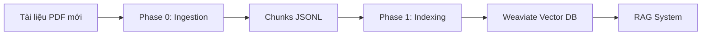

# HƯỚNG DẪN INGESTION VÀ INDEXING TÀI LIỆU MỚI

> **Tài liệu này hướng dẫn chi tiết quy trình xử lý tài liệu mới và đưa vào hệ thống RAG**
>
> **Hệ điều hành:** Windows
> **Shell:** PowerShell 5.1+
> **Cập nhật lần cuối:** 2025-10-15

---

## 📋 MỤC LỤC

1. [Tổng quan quy trình](#1-tổng-quan-quy-trình)
2. [Yêu cầu môi trường](#2-yêu-cầu-môi-trường)
3. [Chuẩn bị tài liệu nguồn](#3-chuẩn-bị-tài-liệu-nguồn)
4. [Bước 1: Ingestion (Xử lý tài liệu)](#4-bước-1-ingestion-xử-lý-tài-liệu)
5. [Bước 2: Indexing vào Weaviate](#5-bước-2-indexing-vào-weaviate)
6. [Kiểm tra kết quả](#6-kiểm-tra-kết-quả)
7. [Xử lý lỗi thường gặp](#7-xử-lý-lỗi-thường-gặp)
8. [Các tham số nâng cao](#8-các-tham-số-nâng-cao)
9. [Backup và Recovery](#9-backup-và-recovery)

---

## 1. TỔNG QUAN QUY TRÌNH



### Quy trình 2 bước:

**Phase 0 - Ingestion:**
- Parse PDF → Extract text & images
- Chunking (chia nhỏ văn bản)
- Extract metadata (vendor, equipment_type, doc_type, etc.)
- Output: `artifacts/ingestion/chunks/*.jsonl`

**Phase 1 - Indexing:**
- Đọc chunks từ JSONL
- Generate embeddings (Gemini/OpenAI)
- Upload vào Weaviate với vector index

---

## 2. YÊU CẦU MÔI TRƯỜNG

### Kiểm tra môi trường hiện tại:

```powershell
# 1. Kiểm tra Python virtual environment
Get-Command python | Select-Object Source

# 2. Kiểm tra Weaviate container đang chạy
docker ps | Select-String weaviate

# 3. Kiểm tra kết nối Weaviate
Invoke-RestMethod -Uri http://localhost:8080/v1/.well-known/ready
```

### Nếu Weaviate chưa chạy:

```powershell
# Khởi động Weaviate container
docker start weaviate

# Hoặc nếu chưa có container, tạo mới:
docker-compose up -d
```

### Nếu virtual environment chưa active:

```powershell
# Di chuyển đến thư mục project
cd "C:\Users\Admin\Desktop\Code - API_LLM_PVCFC"

# Kích hoạt virtual environment chính
.\venv\Scripts\Activate.ps1
```

**Kiểm tra đã activate thành công:** prompt sẽ có `(venv)` ở đầu dòng.

---

## 3. CHUẨN BỊ TÀI LIỆU NGUỒN

### Cấu trúc thư mục tài liệu đầu vào:

```
data_2024/
├── {EQUIPMENT_ID}/
│   ├── {EQUIPMENT_TYPE}/
│   │   ├── {VENDOR}/
│   │   │   ├── {DOC_TYPE}/
│   │   │   │   ├── document1.pdf
│   │   │   │   └── document2.pdf
```

### Ví dụ thực tế:

```
data_2024/
├── K06101/
│   ├── CO2_COMPRESSOR/
│   │   ├── HITACHI/
│   │   │   ├── Manual/
│   │   │   │   ├── MANUAL_COMPRESSOR_K06101.pdf
│   │   │   │   └── Operation_Guide.pdf
│   │   │   ├── Datasheet/
│   │   │   │   └── K06101_Specs.pdf
```

### Đặt tài liệu mới:

```powershell
# 1. Tạo cấu trúc thư mục cho thiết bị mới (nếu chưa có)
New-Item -ItemType Directory -Path "data_2024\K06102\PUMP\SIEMENS\Manual" -Force

# 2. Copy file PDF vào thư mục tương ứng
Copy-Item "D:\new_docs\pump_manual.pdf" -Destination "data_2024\K06102\PUMP\SIEMENS\Manual\"

# 3. Kiểm tra file đã được đặt đúng
Get-ChildItem -Path "data_2024" -Recurse -Filter "*.pdf" | Select-Object FullName
```

---

## 4. BƯỚC 1: INGESTION (XỬ LÝ TÀI LIỆU)

### 4.1. Xác minh môi trường

```powershell
# Di chuyển đến thư mục project
cd "C:\Users\Admin\Desktop\Code - API_LLM_PVCFC"

# Kích hoạt virtual environment (nếu chưa active)
.\venv\Scripts\Activate.ps1

# Kiểm tra script ingestion tồn tại
Test-Path "scripts\phase0_ingest.py"
```

### 4.2. Chạy Ingestion đầy đủ (tất cả tài liệu)

**Trường hợp 1: Ingestion lần đầu hoặc xử lý lại toàn bộ**

```powershell
python scripts/phase0_ingest.py `
  --input-dir data_2024 `
  --output-dir artifacts/ingestion `
  --clear
```

**Giải thích tham số:**
- `--input-dir data_2024`: Thư mục chứa PDF nguồn
- `--output-dir artifacts/ingestion`: Thư mục lưu kết quả
- `--clear`: Xóa artifacts cũ trước khi chạy (bắt buộc cho lần đầu)

### 4.3. Chạy Ingestion chỉ với tài liệu mới (khuyến nghị)

**Trường hợp 2: Chỉ xử lý tài liệu mới thêm vào**

```powershell
python scripts/phase0_ingest.py `
  --input-dir data_2024 `
  --output-dir artifacts/ingestion `
  --skip-existing
```

**Giải thích tham số:**
- `--skip-existing`: Bỏ qua các file đã được xử lý (dựa vào doc_id_map.json)
- **KHÔNG dùng --clear**: giữ lại kết quả cũ

### 4.4. Theo dõi tiến trình

Trong quá trình chạy, bạn sẽ thấy:

```
2025-10-15 07:00:00.123 | INFO | Scanning input directory: data_2024
2025-10-15 07:00:01.456 | INFO | Found 85 PDF files
2025-10-15 07:00:02.789 | INFO | Processing: K06101/CO2_COMPRESSOR/HITACHI/Manual/doc1.pdf
...
2025-10-15 07:05:30.123 | SUCCESS | Ingestion complete: 5130 chunks from 77 documents
```

### 4.5. Kiểm tra kết quả Ingestion

```powershell
# Xem số lượng file chunks được tạo
Get-ChildItem -Path "artifacts\ingestion\chunks" -Filter "*.jsonl" | Measure-Object

# Xem nội dung doc_id_map (danh sách tài liệu đã xử lý)
Get-Content "artifacts\ingestion\metadata\doc_id_map.json" | ConvertFrom-Json | Format-List

# Xem mẫu chunk đầu tiên
Get-Content "artifacts\ingestion\chunks\chunks_001.jsonl" -First 5
```

**Kết quả mong đợi:**
- File `artifacts/ingestion/chunks/chunks_001.jsonl` tồn tại
- File `artifacts/ingestion/metadata/doc_id_map.json` chứa danh sách tài liệu
- Số chunks trong log khớp với số dòng trong file JSONL

---

## 5. BƯỚC 2: INDEXING VÀO WEAVIATE

### 5.1. Xác minh Weaviate đang chạy

```powershell
# Kiểm tra Weaviate healthy
$health = Invoke-RestMethod -Uri http://localhost:8080/v1/.well-known/ready
if ($health) { Write-Host "✓ Weaviate đang chạy và sẵn sàng" -ForegroundColor Green }
```

### 5.2. Chạy Indexing lần đầu (xóa dữ liệu cũ)

**Trường hợp 1: Indexing lần đầu hoặc muốn xóa toàn bộ và index lại**

```powershell
python scripts/phase1_index_to_weaviate.py `
  --chunks-dir artifacts/ingestion/chunks `
  --clear-existing
```

**Giải thích tham số:**
- `--chunks-dir artifacts/ingestion/chunks`: Thư mục chứa chunks JSONL
- `--clear-existing`: Xóa collection Chunk cũ trong Weaviate trước khi index

**⚠️ CẢNH BÁO:** `--clear-existing` sẽ xóa TOÀN BỘ dữ liệu trong Weaviate. Chỉ dùng khi:
- Lần đầu tiên index
- Muốn rebuild toàn bộ index
- Có backup dữ liệu

### 5.3. Chạy Indexing bổ sung (thêm chunks mới)

**Trường hợp 2: Chỉ thêm chunks mới vào Weaviate (không xóa dữ liệu cũ)**

```powershell
python scripts/phase1_index_to_weaviate.py `
  --chunks-dir artifacts/ingestion/chunks `
  --no-clear
```

**Giải thích:**
- `--no-clear` hoặc không dùng `--clear-existing`: Giữ nguyên dữ liệu cũ, chỉ thêm chunks mới

**Lưu ý:** Script có thể phát hiện duplicate dựa trên chunk_id nếu được cấu hình.

### 5.4. Theo dõi tiến trình Indexing

Trong quá trình chạy, bạn sẽ thấy:

```
2025-10-15 07:10:00.123 | INFO | Loaded doc_id_map with 77 entries
2025-10-15 07:10:00.456 | INFO | Connecting to Weaviate at http://localhost:8080...
2025-10-15 07:10:01.123 | SUCCESS | Connected to Weaviate
2025-10-15 07:10:01.456 | INFO | Loading chunks from 1 files...
2025-10-15 07:10:02.789 | SUCCESS | Loaded 5130 chunks from 1 files
2025-10-15 07:10:03.123 | INFO | Enriching chunks with metadata...
2025-10-15 07:10:04.456 | INFO | Generating embeddings...
...
2025-10-15 07:15:30.123 | SUCCESS | Successfully indexed 5130 chunks to Weaviate
```

**Các cảnh báo bình thường:**
- `Text truncated from 23947 to 10000 chars`: Gemini embedding có giới hạn độ dài, phần dư bị cắt
- `ALTS creds ignored`: Cảnh báo Google Cloud, không ảnh hưởng khi chạy local

### 5.5. Kiểm tra embedding cache

```powershell
# Xem cache database
Get-Item "artifacts\ingestion\cache\embeddings.sqlite" | Select-Object Length, LastWriteTime

# Số lượng embeddings đã cache (optional, cần sqlite3)
# sqlite3 artifacts\ingestion\cache\embeddings.sqlite "SELECT COUNT(*) FROM embeddings;"
```

---

## 6. KIỂM TRA KẾT QUẢ

### 6.1. Kiểm tra số lượng chunks trong Weaviate

```powershell
$body = '{ "query": "{ Aggregate { Chunk { meta { count } } } }" }'
$result = Invoke-RestMethod -Method Post -Uri http://localhost:8080/v1/graphql `
  -Headers @{ "Content-Type" = "application/json" } `
  -Body $body
$count = $result.data.Aggregate.Chunk[0].meta.count
Write-Host "✓ Tổng số chunks trong Weaviate: $count" -ForegroundColor Green
```

**Kết quả mong đợi:** Số chunks khớp với log của phase1_index_to_weaviate.py

### 6.2. Kiểm tra phân bổ theo vendor

```powershell
$body = '{ "query": "{ Aggregate { Chunk(groupBy:[\"vendor\"], limit:10) { groupedBy { value } meta { count } } } }" }'
$result = Invoke-RestMethod -Method Post -Uri http://localhost:8080/v1/graphql `
  -Headers @{ "Content-Type" = "application/json" } `
  -Body $body
$result.data.Aggregate.Chunk | ForEach-Object {
  $vendor = $_.groupedBy.value
  $count = $_.meta.count
  Write-Host "$vendor : $count chunks"
}
```

### 6.3. Kiểm tra phân bổ theo doc_type

```powershell
$body = '{ "query": "{ Aggregate { Chunk(groupBy:[\"doc_type\"], limit:10) { groupedBy { value } meta { count } } } }" }'
$result = Invoke-RestMethod -Method Post -Uri http://localhost:8080/v1/graphql `
  -Headers @{ "Content-Type" = "application/json" } `
  -Body $body
$result.data.Aggregate.Chunk | ForEach-Object {
  $docType = $_.groupedBy.value
  $count = $_.meta.count
  Write-Host "$docType : $count chunks"
}
```

### 6.4. Lấy mẫu chunks để kiểm tra

```powershell
$body = '{ "query": "{ Get { Chunk(limit: 3) { doc_id doc_type vendor equipment_id equipment_type text } } }" }'
$result = Invoke-RestMethod -Method Post -Uri http://localhost:8080/v1/graphql `
  -Headers @{ "Content-Type" = "application/json" } `
  -Body $body
$result.data.Get.Chunk | ForEach-Object {
  Write-Host "---"
  Write-Host "Doc ID: $($_.doc_id)"
  Write-Host "Type: $($_.doc_type) | Vendor: $($_.vendor)"
  Write-Host "Equipment: $($_.equipment_type) [$($_.equipment_id)]"
  Write-Host "Text preview: $($_.text.Substring(0, [Math]::Min(100, $_.text.Length)))..."
}
```

### 6.5. Test tìm kiếm BM25 (keyword search)

```powershell
$body = '{ "query": "{ Get { Chunk(bm25: { query: \"manual\" }, limit: 3) { doc_id doc_type text } } }" }'
$result = Invoke-RestMethod -Method Post -Uri http://localhost:8080/v1/graphql `
  -Headers @{ "Content-Type" = "application/json" } `
  -Body $body
Write-Host "✓ Tìm kiếm BM25 'manual' trả về $($result.data.Get.Chunk.Count) kết quả" -ForegroundColor Green
```

### 6.6. Kiểm tra shard health

```powershell
$shards = Invoke-RestMethod -Method Get -Uri http://localhost:8080/v1/schema/Chunk/shards
$shards | ForEach-Object {
  $status = if ($_.status -eq "READY") { "✓" } else { "✗" }
  Write-Host "$status Shard: $($_.name) | Status: $($_.status) | Queue: $($_.vectorQueueSize)"
}
```

---

## 7. XỬ LÝ LỖI THƯỜNG GẶP

### Lỗi 1: ModuleNotFoundError: No module named 'weaviate.classes'

**Nguyên nhân:** Đang ở sai virtual environment hoặc chưa cài weaviate-client

**Giải pháp:**

```powershell
# Deactivate environment hiện tại (nếu có)
deactivate

# Activate lại venv chính
.\venv\Scripts\Activate.ps1

# Kiểm tra weaviate-client
pip show weaviate-client

# Nếu chưa có, cài đặt:
pip install weaviate-client
```

### Lỗi 2: Weaviate connection refused

**Nguyên nhân:** Container Weaviate chưa chạy

**Giải pháp:**

```powershell
# Kiểm tra container
docker ps -a | Select-String weaviate

# Nếu stopped, khởi động:
docker start weaviate

# Chờ 10 giây cho Weaviate sẵn sàng
Start-Sleep -Seconds 10

# Kiểm tra lại
Invoke-RestMethod -Uri http://localhost:8080/v1/.well-known/ready
```

### Lỗi 3: GEMINI_API_KEY not found

**Nguyên nhân:** Thiếu API key cho Gemini embedding

**Giải pháp:**

```powershell
# Kiểm tra biến môi trường
$env:GEMINI_API_KEY

# Nếu không có, set trong session hiện tại:
$env:GEMINI_API_KEY = "YOUR_API_KEY_HERE"

# Hoặc thêm vào file .env:
Add-Content -Path ".env" -Value "GEMINI_API_KEY=YOUR_API_KEY_HERE"
```

### Lỗi 4: FileNotFoundError: data_2024 not found

**Nguyên nhân:** Đang chạy script ở sai thư mục

**Giải pháp:**

```powershell
# Di chuyển về thư mục gốc project
cd "C:\Users\Admin\Desktop\Code - API_LLM_PVCFC"

# Kiểm tra thư mục data_2024 tồn tại
Test-Path "data_2024"

# Nếu không có, tạo mới:
New-Item -ItemType Directory -Path "data_2024" -Force
```

### Lỗi 5: Text truncated warning

**Nguyên nhân:** Chunk quá dài (>10,000 chars) cho Gemini embedding

**Giải pháp:** Đây là WARNING bình thường, không phải lỗi. Script tự động cắt text.

Nếu muốn giảm warning:
- Điều chỉnh chunk_size nhỏ hơn trong config ingestion
- File config: `configs/ingestion_config.yaml`

### Lỗi 6: Memory error khi xử lý PDF lớn

**Nguyên nhân:** PDF có nhiều hình ảnh hoặc kích thước lớn

**Giải pháp:**

```powershell
# Giảm batch size khi ingestion
python scripts/phase0_ingest.py `
  --input-dir data_2024 `
  --output-dir artifacts/ingestion `
  --batch-size 10
```

---

## 8. CÁC THAM SỐ NÂNG CAO

### 8.1. Phase 0: Ingestion

```powershell
python scripts/phase0_ingest.py --help
```

**Các tham số hay dùng:**

| Tham số | Mô tả | Giá trị mặc định | Ví dụ |
|---------|-------|------------------|-------|
| `--input-dir` | Thư mục chứa PDF nguồn | `data_2024` | `--input-dir data_2024` |
| `--output-dir` | Thư mục lưu kết quả | `artifacts/ingestion` | `--output-dir artifacts/ingestion` |
| `--clear` | Xóa artifacts cũ | `False` | `--clear` |
| `--skip-existing` | Bỏ qua file đã xử lý | `False` | `--skip-existing` |
| `--chunk-size` | Kích thước chunk (chars) | `1000` | `--chunk-size 1500` |
| `--chunk-overlap` | Độ overlap giữa chunks | `200` | `--chunk-overlap 300` |
| `--extract-images` | Trích xuất hình ảnh | `True` | `--no-extract-images` |
| `--max-workers` | Số worker song song | `4` | `--max-workers 8` |
| `--log-level` | Mức độ log | `INFO` | `--log-level DEBUG` |

**Ví dụ nâng cao:**

```powershell
# Ingestion với chunk size lớn hơn và nhiều worker
python scripts/phase0_ingest.py `
  --input-dir data_2024 `
  --output-dir artifacts/ingestion `
  --chunk-size 2000 `
  --chunk-overlap 400 `
  --max-workers 8 `
  --skip-existing
```

### 8.2. Phase 1: Indexing

```powershell
python scripts/phase1_index_to_weaviate.py --help
```

**Các tham số hay dùng:**

| Tham số | Mô tả | Giá trị mặc định | Ví dụ |
|---------|-------|------------------|-------|
| `--chunks-dir` | Thư mục chứa chunks JSONL | `artifacts/ingestion/chunks` | `--chunks-dir artifacts/ingestion/chunks` |
| `--weaviate-url` | URL Weaviate | `http://localhost:8080` | `--weaviate-url http://localhost:8080` |
| `--clear-existing` | Xóa collection cũ | `False` | `--clear-existing` |
| `--batch-size` | Số objects/batch | `100` | `--batch-size 200` |
| `--embedding-provider` | Provider embedding | `gemini` | `--embedding-provider openai` |
| `--embedding-model` | Model embedding | `gemini-embedding-001` | `--embedding-model text-embedding-3-small` |
| `--embedding-dim` | Chiều vector | `768` | `--embedding-dim 1536` |

**Ví dụ nâng cao:**

```powershell
# Indexing với OpenAI embeddings thay vì Gemini
python scripts/phase1_index_to_weaviate.py `
  --chunks-dir artifacts/ingestion/chunks `
  --embedding-provider openai `
  --embedding-model text-embedding-3-small `
  --embedding-dim 1536 `
  --batch-size 200 `
  --clear-existing
```

---

## 9. BACKUP VÀ RECOVERY

### 9.1. Backup dữ liệu Weaviate

**Phương án 1: Docker volume backup**

```powershell
# Stop container
docker stop weaviate

# Backup volume
docker run --rm -v weaviate_data:/data -v ${PWD}:/backup `
  alpine tar czf /backup/weaviate_backup_$(Get-Date -Format 'yyyyMMdd_HHmmss').tar.gz -C /data .

# Start lại container
docker start weaviate
```

**Phương án 2: Export qua API (khuyến nghị cho production)**

```powershell
# Export toàn bộ Chunk collection
# (Cần script riêng hoặc sử dụng Weaviate backup module)
# Tham khảo: https://weaviate.io/developers/weaviate/configuration/backups
```

### 9.2. Backup artifacts ingestion

```powershell
# Backup thư mục artifacts
$backupName = "artifacts_backup_$(Get-Date -Format 'yyyyMMdd_HHmmss')"
Compress-Archive -Path "artifacts\ingestion" -DestinationPath "backups\$backupName.zip"

Write-Host "✓ Backup đã lưu tại: backups\$backupName.zip" -ForegroundColor Green
```

### 9.3. Restore từ backup

**Restore artifacts:**

```powershell
# Giải nén backup artifacts
$backupFile = "backups\artifacts_backup_20250115_070000.zip"
Expand-Archive -Path $backupFile -DestinationPath "artifacts_restored" -Force

# Chạy lại indexing từ artifacts restore
python scripts/phase1_index_to_weaviate.py `
  --chunks-dir artifacts_restored/chunks `
  --clear-existing
```

**Restore Weaviate volume:**

```powershell
# Stop container
docker stop weaviate

# Restore volume từ backup
docker run --rm -v weaviate_data:/data -v ${PWD}:/backup `
  alpine sh -c "cd /data && tar xzf /backup/weaviate_backup_20250115_070000.tar.gz"

# Start lại container
docker start weaviate
```

---

## 10. QUY TRÌNH ĐẦY ĐỦ - CHECKLIST

### ✅ Checklist cho tài liệu mới

**Trước khi bắt đầu:**
- [ ] Weaviate container đang chạy
- [ ] Virtual environment `venv` đã activate
- [ ] Đã có API key (GEMINI_API_KEY hoặc OPENAI_API_KEY)

**Bước 1: Chuẩn bị tài liệu**
- [ ] Đặt file PDF vào đúng cấu trúc thư mục `data_2024/`
- [ ] Đặt tên thư mục theo quy ước: `{EQUIPMENT_ID}/{EQUIPMENT_TYPE}/{VENDOR}/{DOC_TYPE}/`

**Bước 2: Ingestion**
- [ ] Chạy `python scripts/phase0_ingest.py` với tham số phù hợp
- [ ] Kiểm tra log không có ERROR
- [ ] Xác nhận file chunks JSONL được tạo trong `artifacts/ingestion/chunks/`

**Bước 3: Indexing**
- [ ] Chạy `python scripts/phase1_index_to_weaviate.py` với tham số phù hợp
- [ ] Kiểm tra log: "Successfully indexed X chunks to Weaviate"
- [ ] Không có ERROR trong quá trình embedding/indexing

**Bước 4: Kiểm tra**
- [ ] Query số lượng chunks trong Weaviate khớp với log
- [ ] Test tìm kiếm BM25 trả về kết quả hợp lý
- [ ] Shard status = READY
- [ ] Node status = HEALTHY

**Sau khi hoàn thành:**
- [ ] Backup artifacts nếu cần
- [ ] Ghi chú lại số lượng tài liệu/chunks mới trong log file

---

## 11. SCRIPT MẪU TỔNG HỢP

### Script PowerShell hoàn chỉnh cho quy trình full

Lưu file này với tên `run_full_ingestion.ps1`:

```powershell
# ===================================================================
# SCRIPT INGESTION & INDEXING HOÀN CHỈNH
# ===================================================================

param(
    [string]$InputDir = "data_2024",
    [string]$OutputDir = "artifacts/ingestion",
    [switch]$ClearArtifacts,
    [switch]$ClearWeaviate,
    [switch]$SkipExisting
)

# --- Configuration ---
$ProjectRoot = "C:\Users\Admin\Desktop\Code - API_LLM_PVCFC"
$WeaviateUrl = "http://localhost:8080"

# --- Functions ---
function Write-Step {
    param([string]$Message)
    Write-Host "`n===== $Message =====" -ForegroundColor Cyan
}

function Write-Success {
    param([string]$Message)
    Write-Host "✓ $Message" -ForegroundColor Green
}

function Write-Error {
    param([string]$Message)
    Write-Host "✗ $Message" -ForegroundColor Red
}

# --- Main Script ---
Set-Location $ProjectRoot

# Step 0: Kiểm tra môi trường
Write-Step "Bước 0: Kiểm tra môi trường"

# Check virtual environment
if (-not $env:VIRTUAL_ENV) {
    Write-Host "Kích hoạt virtual environment..."
    & ".\venv\Scripts\Activate.ps1"
}
Write-Success "Virtual environment: $(Split-Path $env:VIRTUAL_ENV -Leaf)"

# Check Weaviate
try {
    $health = Invoke-RestMethod -Uri "$WeaviateUrl/v1/.well-known/ready" -ErrorAction Stop
    Write-Success "Weaviate đang chạy tại $WeaviateUrl"
} catch {
    Write-Error "Weaviate không khả dụng. Đang khởi động..."
    docker start weaviate
    Start-Sleep -Seconds 10
}

# Step 1: Ingestion
Write-Step "Bước 1: Ingestion (Xử lý tài liệu PDF)"

$ingestArgs = @(
    "scripts/phase0_ingest.py",
    "--input-dir", $InputDir,
    "--output-dir", $OutputDir
)

if ($ClearArtifacts) { $ingestArgs += "--clear" }
if ($SkipExisting) { $ingestArgs += "--skip-existing" }

Write-Host "Đang chạy: python $($ingestArgs -join ' ')"
& python $ingestArgs

if ($LASTEXITCODE -ne 0) {
    Write-Error "Ingestion thất bại!"
    exit 1
}
Write-Success "Ingestion hoàn thành"

# Step 2: Indexing
Write-Step "Bước 2: Indexing vào Weaviate"

$indexArgs = @(
    "scripts/phase1_index_to_weaviate.py",
    "--chunks-dir", "$OutputDir/chunks"
)

if ($ClearWeaviate) { $indexArgs += "--clear-existing" }

Write-Host "Đang chạy: python $($indexArgs -join ' ')"
& python $indexArgs

if ($LASTEXITCODE -ne 0) {
    Write-Error "Indexing thất bại!"
    exit 1
}
Write-Success "Indexing hoàn thành"

# Step 3: Kiểm tra kết quả
Write-Step "Bước 3: Kiểm tra kết quả"

$body = '{ "query": "{ Aggregate { Chunk { meta { count } } } }" }'
$result = Invoke-RestMethod -Method Post -Uri "$WeaviateUrl/v1/graphql" `
    -Headers @{ "Content-Type" = "application/json" } `
    -Body $body

$count = $result.data.Aggregate.Chunk[0].meta.count
Write-Success "Tổng số chunks trong Weaviate: $count"

Write-Step "Hoàn thành toàn bộ quy trình!"
```

**Cách sử dụng script:**

```powershell
# Chạy full ingestion lần đầu (xóa dữ liệu cũ)
.\run_full_ingestion.ps1 -ClearArtifacts -ClearWeaviate

# Chạy incremental ingestion (chỉ thêm tài liệu mới)
.\run_full_ingestion.ps1 -SkipExisting

# Chạy với thư mục khác
.\run_full_ingestion.ps1 -InputDir "data_2025" -SkipExisting
```

---

## 12. TÀI LIỆU THAM KHẢO

### Liên kết hữu ích:

- **Weaviate Documentation:** https://weaviate.io/developers/weaviate
- **Gemini Embedding API:** https://ai.google.dev/docs/embeddings_guide
- **LangChain Text Splitters:** https://python.langchain.com/docs/modules/data_connection/document_transformers/

### Cấu trúc thư mục project:

```
Code - API_LLM_PVCFC/
├── data_2024/              # Tài liệu PDF nguồn
├── artifacts/
│   └── ingestion/
│       ├── chunks/         # Chunks JSONL output
│       ├── metadata/       # doc_id_map.json
│       └── cache/          # Embedding cache
├── scripts/
│   ├── phase0_ingest.py    # Script ingestion
│   └── phase1_index_to_weaviate.py  # Script indexing
├── venv/                   # Virtual environment
├── docker-compose.yml      # Weaviate config
└── HUONG_DAN_INGESTION.md  # File này
```

---

## 📞 HỖ TRỢ & BÁO LỖI

Nếu gặp vấn đề không được mô tả trong tài liệu này:

1. **Kiểm tra log chi tiết:** Chạy script với `--log-level DEBUG`
2. **Kiểm tra Weaviate logs:** `docker logs weaviate`
3. **Xem artifacts:** Kiểm tra file trong `artifacts/ingestion/`

---

**Cập nhật lần cuối:** 2025-10-15
**Phiên bản:** 1.0
**Tác giả:** Team RAG System
