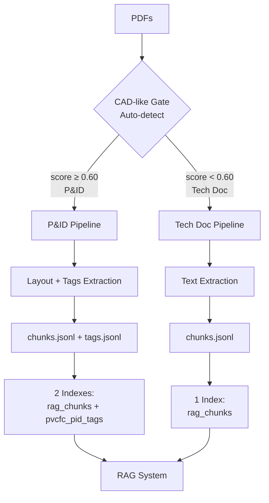

# HƯỚNG DẪN INGESTION VÀ INDEXING TÀI LIỆU MỚI

> **Tài liệu này hướng dẫn chi tiết quy trình xử lý tài liệu mới và đưa vào hệ thống RAG**
>
> **Hệ điều hành:** Windows
> **Shell:** PowerShell 5.1+
> **Cập nhật lần cuối:** 2025-10-15

---

## 📋 MỤC LỤC

1. [Tổng quan quy trình](#1-tổng-quan-quy-trình)
2. [Yêu cầu môi trường](#2-yêu-cầu-môi-trường)
3. [Chuẩn bị tài liệu nguồn](#3-chuẩn-bị-tài-liệu-nguồn)
4. [Bước 1: Ingestion (Xử lý tài liệu)](#4-bước-1-ingestion-xử-lý-tài-liệu)
5. [Bước 2: Build Search Indices](#5-bước-2-build-search-indices)
6. [Kiểm tra kết quả](#6-kiểm-tra-kết-quả)
7. [Xử lý lỗi thường gặp](#7-xử-lý-lỗi-thường-gặp)
8. [Các tham số nâng cao](#8-các-tham-số-nâng-cao)
9. [Backup và Recovery](#9-backup-và-recovery)

---

## 1. TỔNG QUAN QUY TRÌNH

> **⚠️ QUAN TRỌNG**: Hệ thống có **2 PIPELINE SONG SONG** tự động phân loại tài liệu:
> - **Technical Doc Pipeline** (Manuals, Datasheets) → Standard processing
> - **P&ID Pipeline** (P&ID, PFD, ISO drawings) → Extended processing với tags



### Quy trình 2 loại tài liệu:

#### **Loại 1: Technical Doc** (Standard - Mặc định)

**Áp dụng cho:** Manuals, Datasheets, Specifications, Operating Procedures

**Phase 0 - Ingestion**:
- Parse PDF → Extract text (OCR nếu cần)
- Chunking văn bản (semantic)
- Output: `chunks.jsonl`, `doc_id_map.json`

**Phase 1 - Indexing**:
- **BM25 Chunk Index**: Keyword search
- **Weaviate**: Vector search (semantic)
- **Page BM25 Index**: Citation accuracy

#### **Loại 2: P&ID** (Extended - Khi enable)

> **Enable**: Set `ENABLE_PID_TAGS=true` trong `.env`

**Áp dụng cho:** P&ID, PFD, Instrument Drawings, ISO Diagrams

**Phase 0 - Ingestion (MỞ RỘNG)**:
- Parse PDF → Extract text (giống tech doc)
- **+ CAD-like Gate**: Auto-detect P&ID (8 features)
- **+ Page Layout**: Extract spatial layout (bbox, font, drawings)
- **+ Tag Extraction**: Extract instrument tags (04 PSAL 2207)
- **+ Crop Generation**: Generate PNG crops of tags
- Output: `chunks.jsonl` + **`tags.jsonl`** + **`crops/*.png`**

**Phase 1 - Indexing (DUAL)**:
- **Index 1**: `rag_chunks` (BM25 + Weaviate) ← *Giống tech doc*
- **Index 2**: `pvcfc_pid_tags` (OpenSearch sidecar) ← *⭐ UNIQUE*
- **Page BM25 Index**: Citation accuracy

**Tại sao cần dual pipeline?**
- **P&ID**: Cần spatial layout + tags để tìm chính xác instrument tags
- **Tech Doc**: Chỉ cần text semantic search
- **P&ID vẫn có chunks** → Fallback sang semantic search nếu cần

---

## 2. YÊU CẦU MÔI TRƯỜNG

> **⚠️ QUAN TRỌNG: HỆ THỐNG CẦN 2 MÔI TRƯỜNG ẢO RIÊNG BIỆT**

### 2.0 Tại Sao Cần 2 Môi Trường?

**Lý do đơn giản:** PaddleOCR và Weaviate xung đột về protobuf version

```
PaddleOCR cần:  protobuf 3.20.x (cố định)
Weaviate cần:   protobuf >=4.21.6 (tối thiểu)
→ KHÔNG THỂ cài cùng 1 môi trường!
```

**Giải pháp:** 2 môi trường cho 2 công việc khác nhau

| Môi Trường | Dùng Cho | Có Gì | Không Có |
|------------|----------|-------|----------|
| **venv_ingest** | Xử lý PDF (ingestion) | PaddleOCR, OCR | Weaviate |
| **.venv** | Indexing, API, Query | Weaviate, FastAPI | PaddleOCR |

**Quy tắc vàng:**
```
Xử lý PDF    → venv_ingest
Tất cả khác  → .venv
```

### Kiểm tra môi trường hiện tại:

```powershell
# 1. Kiểm tra Python virtual environment
Get-Command python | Select-Object Source

# 2. Kiểm tra Weaviate container đang chạy
docker ps | Select-String weaviate

# 3. Kiểm tra kết nối Weaviate
Invoke-RestMethod -Uri http://localhost:8080/v1/.well-known/ready
```

### Nếu Weaviate chưa chạy:

```powershell
# Khởi động Weaviate container
docker start weaviate

# Hoặc nếu chưa có container, tạo mới:
docker-compose up -d
```

### Activate Đúng Môi Trường:

**CHO INGESTION (Bước 1):**
```powershell
cd "C:\Users\Admin\Desktop\Code - API_LLM_PVCFC"
venv_ingest\Scripts\Activate.ps1  # ← Dùng venv_ingest!
```

**CHO INDEXING/API (Bước 2 trở đi):**
```powershell
cd "C:\Users\Admin\Desktop\Code - API_LLM_PVCFC"
.venv\Scripts\Activate.ps1  # ← Dùng .venv!
```

**Kiểm tra đã activate đúng:**
- Prompt có `(venv_ingest)` → Đúng cho ingestion
- Prompt có `(.venv)` → Đúng cho indexing/API

**Verify PaddleOCR (trong venv_ingest):**
```powershell
python -c "from paddleocr import PaddleOCR; print('PaddleOCR OK')"
```

**Verify Weaviate (trong .venv):**
```powershell
python -c "import weaviate; print('Weaviate OK')"
```

---

## 3. CHUẨN BỊ TÀI LIỆU NGUỒN

### Cấu trúc thư mục tài liệu đầu vào:

```
data_2024/
├── {EQUIPMENT_ID}/
│   ├── {EQUIPMENT_TYPE}/
│   │   ├── {VENDOR}/
│   │   │   ├── {DOC_TYPE}/
│   │   │   │   ├── document1.pdf
│   │   │   │   └── document2.pdf
```

### Ví dụ thực tế:

```
data_2024/
├── K06101/
│   ├── CO2_COMPRESSOR/
│   │   ├── HITACHI/
│   │   │   ├── Manual/
│   │   │   │   ├── MANUAL_COMPRESSOR_K06101.pdf
│   │   │   │   └── Operation_Guide.pdf
│   │   │   ├── Datasheet/
│   │   │   │   └── K06101_Specs.pdf
```

### Đặt tài liệu mới:

```powershell
# 1. Tạo cấu trúc thư mục cho thiết bị mới (nếu chưa có)
New-Item -ItemType Directory -Path "data_2024\K06102\PUMP\SIEMENS\Manual" -Force

# 2. Copy file PDF vào thư mục tương ứng
Copy-Item "D:\new_docs\pump_manual.pdf" -Destination "data_2024\K06102\PUMP\SIEMENS\Manual\"

# 3. Kiểm tra file đã được đặt đúng
Get-ChildItem -Path "data_2024" -Recurse -Filter "*.pdf" | Select-Object FullName
```

---

## 4. BƯỚC 1: INGESTION (XỬ LÝ TÀI LIỆU)

> **Lưu ý**: Ingestion **TỰ ĐỘNG PHÂN LOẠI** tài liệu thành P&ID hoặc Technical Doc

### 4.1. Xác minh môi trường

```powershell
# Di chuyển đến thư mục project
cd "C:\Users\Admin\Desktop\Code - API_LLM_PVCFC"

# Kích hoạt virtual environment (nếu chưa active)
.\venv\Scripts\Activate.ps1

# Kiểm tra script ingestion tồn tại
Test-Path "tools\ingest.py"

# Kiểm tra P&ID tags feature (optional)
$env:ENABLE_PID_TAGS  # "true" = enable P&ID pipeline
```

### 4.2. Chạy Ingestion đầy đủ (tất cả tài liệu)

**Trường hợp 1: Standard Ingestion (Technical Doc only)**

```powershell
# Không có ENABLE_PID_TAGS → chỉ xử lý như Technical Doc
python tools/ingest.py `
  --source-dir data_2024 `
  --output-dir artifacts/ingestion `
  --enable-ocr `
  --workers 4
```

**Trường hợp 2: Full Ingestion (Auto-detect P&ID + Technical Doc)**

```powershell
# Với ENABLE_PID_TAGS=true → tự động phân loại
$env:ENABLE_PID_TAGS = "true"

python tools/ingest.py `
  --source-dir data_2024 `
  --output-dir artifacts/ingestion `
  --enable-ocr `
  --workers 4
```

**Giải thích tham số:**
- `--source-dir data_2024`: Thư mục chứa PDF nguồn (cả Tech Doc và P&ID)
- `--output-dir artifacts/ingestion`: Thư mục lưu kết quả
- `--enable-ocr`: Bật OCR cho các trang quét (sử dụng PaddleOCR PP-OCRv5)
- `--workers 4`: Số luồng xử lý song song (mỗi worker có PaddleOCR instance riêng, an toàn với GPU)

**Quá trình auto-detect:**
```
Mỗi PDF → CAD-like Gate (8 features scoring)
         ↓
    score ≥ 0.60?
         ↓
    YES: P&ID Pipeline (layout + tags + crops + chunks)
    NO:  Tech Doc Pipeline (chunks only)
```

### 4.3. Chạy Ingestion với OCR và xử lý song song

**Trường hợp 2: Xử lý với OCR và nhiều workers (khuyến nghị cho hiệu suất cao)**

```powershell
python tools/ingest.py `
  --source-dir data_2024 `
  --output-dir artifacts/ingestion `
  --enable-ocr `
  --workers 4 `
  --extract-tables
```

**Giải thích tham số:**
- `--enable-ocr`: Bật PaddleOCR cho các trang scan (hỗ trợ tiếng Việt + Anh)
- `--workers 4`: Sử dụng 4 worker threads song song. **Lưu ý quan trọng:**
  - Mỗi worker có PaddleOCR instance riêng (thread-local)
  - An toàn với GPU, không gây xung đột tensor
  - Tăng tốc xử lý đáng kể với nhiều file
- `--extract-tables`: Trích xuất bảng biểu từ PDF (mặc định: bật)

### 4.4. Ví dụ nâng cao: OCR + Song song + Extract tables

**Trường hợp 3: Xử lý đầy đủ với tất cả tính năng**

```powershell
python tools/ingest.py `
  --source-dir "D:\Data_Raw" `
  --output-dir artifacts/ingestion `
  --enable-ocr `
  --ocr-lang "vie+eng" `
  --workers 4 `
  --extract-tables `
  --chunk-size 1000 `
  --chunk-overlap 200
```

**Chi tiết các tham số:**
- `--ocr-lang "vie+eng"`: Ngôn ngữ OCR (tiếng Việt + Anh, mặc định)
- `--chunk-size 1000`: Kích thước chunk (ký tự)
- `--chunk-overlap 200`: Độ chồng lấn giữa các chunks

### 4.5. Theo dõi tiến trình

Trong quá trình chạy với OCR và multi-workers, bạn sẽ thấy:

```
=============================================================
INITIALIZING PP-OCRv5 (PaddleOCR)
=============================================================
Detection Model: ch_PP-OCRv4_det_infer (local)
Recognition Model: Official EN PP-OCRv4 (auto-download)
GPU Enabled: True
=============================================================
2025-10-15 07:00:00 | INFO | Scanning source directory: D:\Data_Raw
2025-10-15 07:00:01 | INFO | Found 77 PDF files
2025-10-15 07:00:02 | INFO | Starting ingestion with 4 workers...
2025-10-15 07:00:03 | DEBUG | Creating new PaddleOCR instance for thread ThreadPoolExecutor-0_0
2025-10-15 07:00:04 | DEBUG | Creating new PaddleOCR instance for thread ThreadPoolExecutor-0_1
2025-10-15 07:00:05 | INFO | Processing: doc1.pdf (worker 0)
2025-10-15 07:00:06 | INFO | Processing: doc2.pdf (worker 1)
...
2025-10-15 07:15:30 | SUCCESS | Ingestion complete: 5130 chunks from 77 documents
```

**Lưu ý:** Khi khởi động, mỗi worker thread sẽ tạo PaddleOCR instance riêng. Đây là thiết kế thread-safe để tránh lỗi GPU tensor conflicts.

### 4.6. Kiểm tra kết quả Ingestion

#### **Kiểm tra Standard Outputs (Cả 2 loại tài liệu)**

```powershell
# Xem số lượng file chunks được tạo
Get-ChildItem -Path "artifacts\ingestion\chunks" -Filter "*.jsonl" | Measure-Object

# Xem nội dung doc_id_map (danh sách tài liệu đã xử lý)
Get-Content "artifacts\ingestion\metadata\doc_id_map.json" | ConvertFrom-Json | Format-List

# Xem mẫu chunk đầu tiên
Get-Content "artifacts\ingestion\chunks\chunks_001.jsonl" -First 5
```

#### **Kiểm tra P&ID Outputs (Nếu enable P&ID tags)**

```powershell
# Kiểm tra tags extracted
if (Test-Path "D:\PVCFC_Artifacts\entities\tags.jsonl") {
    $tagCount = (Get-Content "D:\PVCFC_Artifacts\entities\tags.jsonl").Count
    Write-Host "✓ Extracted $tagCount tags from P&ID documents" -ForegroundColor Green

    # Xem mẫu tag
    Get-Content "D:\PVCFC_Artifacts\entities\tags.jsonl" -First 1 | ConvertFrom-Json
}

# Kiểm tra page layouts
if (Test-Path "D:\PVCFC_Artifacts\page_layout") {
    $layoutCount = (Get-ChildItem "D:\PVCFC_Artifacts\page_layout" -Filter "*.json").Count
    Write-Host "✓ Extracted $layoutCount page layouts" -ForegroundColor Green
}

# Kiểm tra crops (nếu không lazy mode)
if (Test-Path "D:\PVCFC_Artifacts\crops") {
    $cropCount = (Get-ChildItem "D:\PVCFC_Artifacts\crops" -Filter "*.png").Count
    Write-Host "✓ Generated $cropCount tag crops" -ForegroundColor Green
}

# Kiểm tra telemetry logs
if (Test-Path "D:\PVCFC_Artifacts\logs\tag_extraction_telemetry.jsonl") {
    Write-Host "✓ Tag extraction telemetry logged" -ForegroundColor Green

    # Xem summary
    Get-Content "D:\PVCFC_Artifacts\logs\tag_extraction_telemetry.jsonl" |
        ConvertFrom-Json |
        Select-Object doc_id, is_cadlike, tags_found_total, cadlike_score
}
```

**Kết quả mong đợi:**

**Technical Doc:**
- File `chunks.jsonl` tồn tại
- File `doc_id_map.json` chứa danh sách tài liệu
- Số chunks trong log khớp với số dòng trong file

**P&ID (thêm):**
- File `tags.jsonl` chứa extracted tags với bbox
- Thư mục `page_layout/` chứa layout data
- Thư mục `crops/` chứa PNG crops (nếu không lazy)
- File `tag_extraction_telemetry.jsonl` chứa metrics

**Phân biệt trong log:**
```
[INFO] Processing: manual_pump.pdf
[INFO] CAD-like score: 0.12 → NOT P&ID (Tech Doc pipeline)
[INFO] Extracted 45 chunks

[INFO] Processing: P&ID_ammonia_unit.pdf
[INFO] CAD-like score: 0.78 → IS P&ID (Extended pipeline)
[INFO] Selected 25 taggy pages
[INFO] Extracted 245 tags with confidence avg 0.87
[INFO] Generated 245 crops
[INFO] Also extracted 120 standard chunks
```

---

---

## 4.7. Phân tích Auto-Detection Results

### Xem kết quả phân loại của CAD-like Gate:

```powershell
# Nếu có P&ID tags enabled, xem telemetry
if (Test-Path "D:\PVCFC_Artifacts\logs\tag_extraction_telemetry.jsonl") {
    Write-Host "`n=== CAD-LIKE DETECTION SUMMARY ===" -ForegroundColor Cyan

    $telemetry = Get-Content "D:\PVCFC_Artifacts\logs\tag_extraction_telemetry.jsonl" |
        ConvertFrom-Json

    # Phân loại
    $cadlike = $telemetry | Where-Object { $_.is_cadlike -eq $true }
    $notCadlike = $telemetry | Where-Object { $_.is_cadlike -eq $false }

    Write-Host "✓ P&ID Documents: $($cadlike.Count)" -ForegroundColor Green
    Write-Host "✓ Technical Docs: $($notCadlike.Count)" -ForegroundColor Green

    # Show P&ID examples
    Write-Host "`nP&ID Documents (CAD-like):" -ForegroundColor Yellow
    $cadlike | Select-Object doc_id, cadlike_score, tags_found_total |
        Format-Table -AutoSize

    # Show Tech Doc examples
    Write-Host "`nTechnical Documents (NOT CAD-like):" -ForegroundColor Yellow
    $notCadlike | Select-Object doc_id, cadlike_score |
        Format-Table -AutoSize
}
```

**Example Output:**
```
=== CAD-LIKE DETECTION SUMMARY ===
✓ P&ID Documents: 15
✓ Technical Docs: 62

P&ID Documents (CAD-like):
doc_id                          cadlike_score  tags_found_total
------                          -------------  ----------------
P&ID_Ammonia_Unit.pdf           0.78          245
ISO_Process_Flow.pdf            0.85          189
Instrument_Loop_Diagram.pdf     0.72          156

Technical Documents (NOT CAD-like):
doc_id                          cadlike_score
------                          -------------
HCD025_Gear_Manual.pdf          0.12
Pump_Operating_Manual.pdf       0.08
Datasheet_Compressor.pdf        0.15
```

### Phân tích False Positives/Negatives:

```powershell
# Documents với score trong gray zone [0.45-0.60)
$grayZone = $telemetry | Where-Object {
    $_.cadlike_score -ge 0.45 -and $_.cadlike_score -lt 0.60
}

if ($grayZone.Count -gt 0) {
    Write-Host "`n⚠️ Gray Zone Documents (cần review):" -ForegroundColor Yellow
    $grayZone | Select-Object doc_id, cadlike_score, is_cadlike |
        Format-Table -AutoSize
}
```

---

## 5. BƯỚC 2: BUILD SEARCH INDICES

> **Quan trọng:**
> - **Technical Doc**: Chỉ cần BM25 + Weaviate indices
> - **P&ID**: Thêm OpenSearch tags sidecar index

### 5.1. Kiểm tra Weaviate (đã có sẵn)

```powershell
# Kiểm tra số chunks trong Weaviate
$body = '{ "query": "{ Aggregate { Chunk { meta { count } } } }" }'
$result = Invoke-RestMethod -Method Post -Uri http://localhost:8080/v1/graphql `
  -Headers @{ "Content-Type" = "application/json" } -Body $body
$count = $result.data.Aggregate.Chunk[0].meta.count
Write-Host "✓ Weaviate có $count chunks" -ForegroundColor Green
```

**Kết quả mong đợi:** Số chunks khớp với ingestion output (ví dụ: 4,929)

### 5.2. Build BM25 Chunk Index (Bắt buộc)

**Mục đích:** Keyword search để kết hợp với Weaviate semantic search → Hybrid search

```powershell
python tools/build_bm25_index.py `
  --chunks-jsonl "artifacts\ingestion_production\chunks\chunks.jsonl" `
  --index-dir "artifacts\index\bm25"
```

**Output:**
```
Building BM25 index for 4929 documents
Saved BM25 index to artifacts\index\bm25
Test search for 'CO2 compressor': Score 8.67
```

**Files tạo ra:**
- `artifacts/index/bm25/bm25_index.pkl`
- `artifacts/index/bm25/metadata.json`

### 5.3. Build Page BM25 Index (Tùy chọn - cho citation)

**Mục đích:** Tìm exact page number để trả về citation chính xác

```powershell
python tools/build_page_index.py build `
  --doc-id-map "artifacts\ingestion_production\doc_id_map.json" `
  --output-dir "artifacts\index_production"
```

**Output:**
```
Extracting pages from 77 documents...
✅ Wrote 4023 pages to text_by_page.jsonl
Building BM25 page index...
✅ BM25 index saved to page_bm25_index.pkl

Metrics:
- Total Docs: 77
- Pages Indexed: 4023
- OCR Pages: 2455
- Build Time: ~20 mins
```

**Files tạo ra:**
- `artifacts/index_production/text_by_page.jsonl`
- `artifacts/index_production/page_bm25_index.pkl`
- `artifacts/index_production/page_metadata.json`

**Lưu ý:** Có thể skip nếu không cần citation chi tiết (page numbers)

### 5.4. Build P&ID Tags Index (Nếu enable P&ID)

> **Chỉ cần nếu:** `ENABLE_PID_TAGS=true` và có tags extracted

```powershell
# Kiểm tra tags đã extracted
if (Test-Path "D:\PVCFC_Artifacts\entities\tags.jsonl") {
    $tagCount = (Get-Content "D:\PVCFC_Artifacts\entities\tags.jsonl").Count
    Write-Host "✓ Found $tagCount tags to index" -ForegroundColor Green

    # Create OpenSearch tags index
    python scripts\opensearch\create_tags_index.py

    # Bulk upsert tags
    python scripts\opensearch\bulk_upsert_tags.py `
        --tags-jsonl "D:\PVCFC_Artifacts\entities\tags.jsonl"

    # Verify
    curl -X GET "localhost:9200/pvcfc_pid_tags/_count"
} else {
    Write-Host "⚠️ No tags found (P&ID feature disabled or no P&ID documents)" -ForegroundColor Yellow
}
```

**Output:**
```json
{
  "count": 2450,
  "_shards": { "total": 1, "successful": 1, "failed": 0 }
}
```

### 5.5. Tóm tắt các indices

#### **Technical Doc chỉ cần:**

| Index | Location | Count | Mục đích |
|-------|----------|-------|----------|
| **Weaviate** | http://localhost:8080 | 4,838 chunks | Semantic search |
| **BM25 Chunk** | `artifacts/index/bm25` | 4,838 chunks | Keyword search |
| **BM25 Page** | `artifacts/index_production` | ~4,000 pages | Citation (page #) |

#### **P&ID thêm:**

| Index | Location | Count | Mục đích |
|-------|----------|-------|----------|
| **Tags Sidecar** | OpenSearch `pvcfc_pid_tags` | 2,450 tags | Tag-based search |

**Lưu ý:** P&ID documents **CŨNG CÓ** trong `rag_chunks` (92 chunks từ 15 P&ID docs)

---

## 6. KIỂM TRA KẾT QUẢ

### 6.1. Kiểm tra số lượng chunks trong Weaviate

```powershell
$body = '{ "query": "{ Aggregate { Chunk { meta { count } } } }" }'
$result = Invoke-RestMethod -Method Post -Uri http://localhost:8080/v1/graphql `
  -Headers @{ "Content-Type" = "application/json" } `
  -Body $body
$count = $result.data.Aggregate.Chunk[0].meta.count
Write-Host "✓ Tổng số chunks trong Weaviate: $count" -ForegroundColor Green
```

**Kết quả mong đợi:** Số chunks khớp với log của phase1_index_to_weaviate.py

### 6.2. Kiểm tra phân bổ theo vendor

```powershell
$body = '{ "query": "{ Aggregate { Chunk(groupBy:[\"vendor\"], limit:10) { groupedBy { value } meta { count } } } }" }'
$result = Invoke-RestMethod -Method Post -Uri http://localhost:8080/v1/graphql `
  -Headers @{ "Content-Type" = "application/json" } `
  -Body $body
$result.data.Aggregate.Chunk | ForEach-Object {
  $vendor = $_.groupedBy.value
  $count = $_.meta.count
  Write-Host "$vendor : $count chunks"
}
```

### 6.3. Kiểm tra phân bổ theo doc_type

```powershell
$body = '{ "query": "{ Aggregate { Chunk(groupBy:[\"doc_type\"], limit:10) { groupedBy { value } meta { count } } } }" }'
$result = Invoke-RestMethod -Method Post -Uri http://localhost:8080/v1/graphql `
  -Headers @{ "Content-Type" = "application/json" } `
  -Body $body
$result.data.Aggregate.Chunk | ForEach-Object {
  $docType = $_.groupedBy.value
  $count = $_.meta.count
  Write-Host "$docType : $count chunks"
}
```

### 6.4. Lấy mẫu chunks để kiểm tra

```powershell
$body = '{ "query": "{ Get { Chunk(limit: 3) { doc_id doc_type vendor equipment_id equipment_type text } } }" }'
$result = Invoke-RestMethod -Method Post -Uri http://localhost:8080/v1/graphql `
  -Headers @{ "Content-Type" = "application/json" } `
  -Body $body
$result.data.Get.Chunk | ForEach-Object {
  Write-Host "---"
  Write-Host "Doc ID: $($_.doc_id)"
  Write-Host "Type: $($_.doc_type) | Vendor: $($_.vendor)"
  Write-Host "Equipment: $($_.equipment_type) [$($_.equipment_id)]"
  Write-Host "Text preview: $($_.text.Substring(0, [Math]::Min(100, $_.text.Length)))..."
}
```

### 6.5. Test tìm kiếm BM25 (keyword search)

```powershell
$body = '{ "query": "{ Get { Chunk(bm25: { query: \"manual\" }, limit: 3) { doc_id doc_type text } } }" }'
$result = Invoke-RestMethod -Method Post -Uri http://localhost:8080/v1/graphql `
  -Headers @{ "Content-Type" = "application/json" } `
  -Body $body
Write-Host "✓ Tìm kiếm BM25 'manual' trả về $($result.data.Get.Chunk.Count) kết quả" -ForegroundColor Green
```

### 6.6. Kiểm tra shard health

```powershell
$shards = Invoke-RestMethod -Method Get -Uri http://localhost:8080/v1/schema/Chunk/shards
$shards | ForEach-Object {
  $status = if ($_.status -eq "READY") { "✓" } else { "✗" }
  Write-Host "$status Shard: $($_.name) | Status: $($_.status) | Queue: $($_.vectorQueueSize)"
}
```

---

---

## 6.7. Test Queries trên 2 Pipelines

### Test Technical Doc Query:

```powershell
# Query về technical specifications
$body = @{
    query = "What are the setpoints for HCD025 gear unit?"
    language = "en"
    max_context = 8
} | ConvertTo-Json

$response = Invoke-RestMethod -Method Post -Uri "http://localhost:8000/ask" `
    -Headers @{ "Content-Type" = "application/json" } `
    -Body $body

# Kiểm tra retriever được sử dụng
Write-Host "Retriever used: $($response.meta.retriever_type)" -ForegroundColor Cyan
Write-Host "Answer: $($response.answer)"
```

**Expected Output:**
```
Retriever used: technical_doc
Answer: The setpoints for HCD025 gear unit are...
Citations: [Doc 1, p.12] (from manual)
```

### Test P&ID Query:

```powershell
# Query về instrument tag
$body = @{
    query = "What is 04 PSAL 2207 pressure alarm?"
    language = "en"
    max_context = 8
} | ConvertTo-Json

$response = Invoke-RestMethod -Method Post -Uri "http://localhost:8000/ask" `
    -Headers @{ "Content-Type" = "application/json" } `
    -Body $body

# Kiểm tra retriever và sources
Write-Host "Retriever used: $($response.meta.retriever_type)" -ForegroundColor Cyan
Write-Host "Sources: $($response.meta.sources)" -ForegroundColor Yellow
Write-Host "Answer: $($response.answer)"

# Check if bbox present (P&ID specific)
if ($response.citations[0].bbox) {
    Write-Host "✓ Bbox present: $($response.citations[0].bbox)" -ForegroundColor Green
}
if ($response.citations[0].crop_path) {
    Write-Host "✓ Crop available: $($response.citations[0].crop_path)" -ForegroundColor Green
}
```

**Expected Output:**
```
Retriever used: hybrid_with_tags
Sources: [tags, chunks]  ← 2 branches!
Answer: 04 PSAL 2207 is a pressure safety alarm low...
✓ Bbox present: [100, 200, 150, 250]
✓ Crop available: D:\PVCFC_Artifacts\crops\...\04_PSAL_2207.png
```

---

## 7. XỬ LÝ LỖI THƯỜNG GẶP

### Lỗi 0: "Tại sao P&ID không extract tags?"

**Triệu chứng:**
```
[INFO] Processing: P&ID_ammonia.pdf
[INFO] CAD-like score: 0.78 → IS P&ID
[WARNING] PID tags extraction is disabled (ENABLE_PID_TAGS=false)
[INFO] Extracted 45 chunks  ← Chỉ có chunks, không có tags
```

**Nguyên nhân:** `ENABLE_PID_TAGS=false` hoặc không set

**Giải pháp:**
```powershell
# Thêm vào .env
Add-Content -Path ".env" -Value "ENABLE_PID_TAGS=true"

# Hoặc set trong session
$env:ENABLE_PID_TAGS = "true"

# Chạy lại ingestion
python tools/ingest.py --source-dir data_2024 --output-dir artifacts/ingestion
```

### Lỗi 0.5: "Manual được detect là P&ID (False Positive)"

**Triệu chứng:**
```
[INFO] Processing: Pump_Manual.pdf
[INFO] CAD-like score: 0.62 → IS P&ID  ← SAI!
[INFO] Extracted 8 tags  ← False positives
```

**Nguyên nhân:**
- Manual có nhiều diagrams/tables
- Có technical codes giống tags format

**Giải pháp:**
```powershell
# Option 1: Tăng threshold
# Edit config/cadlike_gate.yaml
weights:
  producer_keyword: 0.25  # Tăng weight metadata
  geometry_density: 0.20  # Tăng weight drawings
  regex_3piece_hits: 0.15 # Giảm weight regex

# Option 2: Add exclusion cho filename patterns
# Thêm vào gray_zone_keywords (negative)
gray_zone_exclusions:
  - "manual"
  - "datasheet"
  - "specification"
```

### Lỗi 1: ModuleNotFoundError: No module named 'weaviate.classes'

**Nguyên nhân:** Đang ở sai virtual environment hoặc chưa cài weaviate-client

**Giải pháp:**

```powershell
# Deactivate environment hiện tại (nếu có)
deactivate

# Activate lại venv chính
.\venv\Scripts\Activate.ps1

# Kiểm tra weaviate-client
pip show weaviate-client

# Nếu chưa có, cài đặt:
pip install weaviate-client
```

### Lỗi 2: Weaviate connection refused

**Nguyên nhân:** Container Weaviate chưa chạy

**Giải pháp:**

```powershell
# Kiểm tra container
docker ps -a | Select-String weaviate

# Nếu stopped, khởi động:
docker start weaviate

# Chờ 10 giây cho Weaviate sẵn sàng
Start-Sleep -Seconds 10

# Kiểm tra lại
Invoke-RestMethod -Uri http://localhost:8080/v1/.well-known/ready
```

### Lỗi 3: GEMINI_API_KEY not found

**Nguyên nhân:** Thiếu API key cho Gemini embedding

**Giải pháp:**

```powershell
# Kiểm tra biến môi trường
$env:GEMINI_API_KEY

# Nếu không có, set trong session hiện tại:
$env:GEMINI_API_KEY = "YOUR_API_KEY_HERE"

# Hoặc thêm vào file .env:
Add-Content -Path ".env" -Value "GEMINI_API_KEY=YOUR_API_KEY_HERE"
```

### Lỗi 4: FileNotFoundError: data_2024 not found

**Nguyên nhân:** Đang chạy script ở sai thư mục

**Giải pháp:**

```powershell
# Di chuyển về thư mục gốc project
cd "C:\Users\Admin\Desktop\Code - API_LLM_PVCFC"

# Kiểm tra thư mục data_2024 tồn tại
Test-Path "data_2024"

# Nếu không có, tạo mới:
New-Item -ItemType Directory -Path "data_2024" -Force
```

### Lỗi 5: Text truncated warning

**Nguyên nhân:** Chunk quá dài (>10,000 chars) cho Gemini embedding

**Giải pháp:** Đây là WARNING bình thường, không phải lỗi. Script tự động cắt text.

Nếu muốn giảm warning:
- Điều chỉnh chunk_size nhỏ hơn trong config ingestion
- File config: `configs/ingestion_config.yaml`

### Lỗi 6: Memory error khi xử lý PDF lớn

**Nguyên nhân:** PDF có nhiều hình ảnh hoặc kích thước lớn

**Giải pháp:**

```powershell
# Giảm số workers khi gặp vấn đề memory
python tools/ingest.py `
  --source-dir data_2024 `
  --output-dir artifacts/ingestion `
  --enable-ocr `
  --workers 2
```

### Lỗi 7: GPU tensor conflicts với OCR

**Nguyên nhân:** (Đã được fix) - Trước đây nhiều threads dùng chung PaddleOCR instance

**Giải pháp hiện tại:** Hệ thống đã được fix với thread-local PaddleOCR instances. Bạn có thể an tâm dùng `--workers >1` với `--enable-ocr`.

**Nếu vẫn gặp lỗi:**
```powershell
# Force CPU mode nếu GPU gặp vấn đề
$env:CUDA_VISIBLE_DEVICES = "-1"
python tools/ingest.py --source-dir data_2024 --enable-ocr --workers 4
```

---

## 8. CÁC THAM SỐ NÂNG CAO

### 8.1. Phase 0: Ingestion

```powershell
python tools/ingest.py --help
```

**Các tham số hay dùng:**

| Tham số | Mô tả | Giá trị mặc định | Ví dụ |
|---------|-------|------------------|-------|
| `--source-dir` | Thư mục chứa PDF nguồn | (bắt buộc) | `--source-dir data_2024` |
| `--output-dir` | Thư mục lưu kết quả | `artifacts/ingestion` | `--output-dir artifacts/ingestion` |
| `--enable-ocr` | Bật OCR (PaddleOCR) | `False` | `--enable-ocr` |
| `--ocr-lang` | Ngôn ngữ OCR | `vie+eng` | `--ocr-lang "eng"` |
| `--workers` | Số worker threads | auto (max 4) | `--workers 4` |
| `--chunk-size` | Kích thước chunk (chars) | `1000` | `--chunk-size 1500` |
| `--chunk-overlap` | Độ overlap giữa chunks | `200` | `--chunk-overlap 300` |
| `--extract-tables` | Trích xuất bảng biểu | `True` | `--no-extract-tables` |
| `--parser` | PDF parser engine | `auto` | `--parser pymupdf` |

**⚡ Lưu ý quan trọng về multi-threading với OCR:**
- Hệ thống sử dụng **thread-local PaddleOCR instances**
- Mỗi worker thread có PaddleOCR instance riêng
- **An toàn 100% với GPU** - không gây xung đột tensor
- Có thể dùng `--workers 4` hoặc nhiều hơn với `--enable-ocr` mà không lo lỗi

**Ví dụ nâng cao:**

```powershell
# Ingestion với OCR, nhiều workers, và chunking tùy chỉnh
python tools/ingest.py `
  --source-dir "D:\Data_Raw" `
  --output-dir artifacts/ingestion `
  --enable-ocr `
  --workers 4 `
  --chunk-size 2000 `
  --chunk-overlap 400 `
  --extract-tables
```

### 8.2. Phase 1: Indexing

```powershell
python scripts/phase1_index_to_weaviate.py --help
```

**Các tham số hay dùng:**

| Tham số | Mô tả | Giá trị mặc định | Ví dụ |
|---------|-------|------------------|-------|
| `--chunks-dir` | Thư mục chứa chunks JSONL | `artifacts/ingestion/chunks` | `--chunks-dir artifacts/ingestion/chunks` |
| `--weaviate-url` | URL Weaviate | `http://localhost:8080` | `--weaviate-url http://localhost:8080` |
| `--clear-existing` | Xóa collection cũ | `False` | `--clear-existing` |
| `--batch-size` | Số objects/batch | `100` | `--batch-size 200` |
| `--embedding-provider` | Provider embedding | `gemini` | `--embedding-provider openai` |
| `--embedding-model` | Model embedding | `gemini-embedding-001` | `--embedding-model text-embedding-3-small` |
| `--embedding-dim` | Chiều vector | `768` | `--embedding-dim 1536` |

**Ví dụ nâng cao:**

```powershell
# Indexing với OpenAI embeddings thay vì Gemini
python scripts/phase1_index_to_weaviate.py `
  --chunks-dir artifacts/ingestion/chunks `
  --embedding-provider openai `
  --embedding-model text-embedding-3-small `
  --embedding-dim 1536 `
  --batch-size 200 `
  --clear-existing
```

---

## 9. BACKUP VÀ RECOVERY

### 9.1. Backup dữ liệu Weaviate

**Phương án 1: Docker volume backup**

```powershell
# Stop container
docker stop weaviate

# Backup volume
docker run --rm -v weaviate_data:/data -v ${PWD}:/backup `
  alpine tar czf /backup/weaviate_backup_$(Get-Date -Format 'yyyyMMdd_HHmmss').tar.gz -C /data .

# Start lại container
docker start weaviate
```

**Phương án 2: Export qua API (khuyến nghị cho production)**

```powershell
# Export toàn bộ Chunk collection
# (Cần script riêng hoặc sử dụng Weaviate backup module)
# Tham khảo: https://weaviate.io/developers/weaviate/configuration/backups
```

### 9.2. Backup artifacts ingestion

```powershell
# Backup thư mục artifacts
$backupName = "artifacts_backup_$(Get-Date -Format 'yyyyMMdd_HHmmss')"
Compress-Archive -Path "artifacts\ingestion" -DestinationPath "backups\$backupName.zip"

Write-Host "✓ Backup đã lưu tại: backups\$backupName.zip" -ForegroundColor Green
```

### 9.3. Restore từ backup

**Restore artifacts:**

```powershell
# Giải nén backup artifacts
$backupFile = "backups\artifacts_backup_20250115_070000.zip"
Expand-Archive -Path $backupFile -DestinationPath "artifacts_restored" -Force

# Chạy lại indexing từ artifacts restore
python scripts/phase1_index_to_weaviate.py `
  --chunks-dir artifacts_restored/chunks `
  --clear-existing
```

**Restore Weaviate volume:**

```powershell
# Stop container
docker stop weaviate

# Restore volume từ backup
docker run --rm -v weaviate_data:/data -v ${PWD}:/backup `
  alpine sh -c "cd /data && tar xzf /backup/weaviate_backup_20250115_070000.tar.gz"

# Start lại container
docker start weaviate
```

---

## 10. QUY TRÌNH ĐẦY ĐỦ - CHECKLIST

### ✅ Checklist cho tài liệu mới

**Trước khi bắt đầu:**
- [ ] Weaviate container đang chạy
- [ ] Virtual environment `venv` đã activate
- [ ] Đã có API key (GEMINI_API_KEY hoặc OPENAI_API_KEY)

**Bước 1: Chuẩn bị tài liệu**
- [ ] Đặt file PDF vào đúng cấu trúc thư mục `data_2024/`
- [ ] Đặt tên thư mục theo quy ước: `{EQUIPMENT_ID}/{EQUIPMENT_TYPE}/{VENDOR}/{DOC_TYPE}/`

**Bước 2: Ingestion**
- [ ] Chạy `python tools/ingest.py --source-dir ... --enable-ocr --workers 4`
- [ ] Kiểm tra log không có ERROR
- [ ] Xác nhận `chunks.jsonl` và `doc_id_map.json` được tạo

**Bước 3: Build Indices**
- [ ] Build BM25 chunk index: `python tools/build_bm25_index.py ...`
- [ ] Build page index (optional): `python tools/build_page_index.py build ...`
- [ ] Kiểm tra Weaviate đã có chunks (đã được index từ trước)

**Bước 4: Kiểm tra**
- [ ] Weaviate có đúng số chunks (4,929)
- [ ] BM25 index files tồn tại: `artifacts/index/bm25/bm25_index.pkl`
- [ ] Page index tồn tại: `artifacts/index_production/page_bm25_index.pkl`
- [ ] Test search hoạt động (xem section 6)

**Sau khi hoàn thành:**
- [ ] Backup artifacts nếu cần
- [ ] Ghi chú lại số lượng tài liệu/chunks mới trong log file

---

## 11. SCRIPT MẪU TỔNG HỢP

### Script PowerShell hoàn chỉnh cho quy trình full

Lưu file này với tên `run_full_ingestion.ps1`:

```powershell
# ===================================================================
# SCRIPT INGESTION & INDEXING HOÀN CHỈNH
# ===================================================================

param(
    [string]$InputDir = "data_2024",
    [string]$OutputDir = "artifacts/ingestion",
    [switch]$ClearArtifacts,
    [switch]$ClearWeaviate,
    [switch]$SkipExisting
)

# --- Configuration ---
$ProjectRoot = "C:\Users\Admin\Desktop\Code - API_LLM_PVCFC"
$WeaviateUrl = "http://localhost:8080"

# --- Functions ---
function Write-Step {
    param([string]$Message)
    Write-Host "`n===== $Message =====" -ForegroundColor Cyan
}

function Write-Success {
    param([string]$Message)
    Write-Host "✓ $Message" -ForegroundColor Green
}

function Write-Error {
    param([string]$Message)
    Write-Host "✗ $Message" -ForegroundColor Red
}

# --- Main Script ---
Set-Location $ProjectRoot

# Step 0: Kiểm tra môi trường
Write-Step "Bước 0: Kiểm tra môi trường"

# Check virtual environment
if (-not $env:VIRTUAL_ENV) {
    Write-Host "Kích hoạt virtual environment..."
    & ".\venv\Scripts\Activate.ps1"
}
Write-Success "Virtual environment: $(Split-Path $env:VIRTUAL_ENV -Leaf)"

# Check Weaviate
try {
    $health = Invoke-RestMethod -Uri "$WeaviateUrl/v1/.well-known/ready" -ErrorAction Stop
    Write-Success "Weaviate đang chạy tại $WeaviateUrl"
} catch {
    Write-Error "Weaviate không khả dụng. Đang khởi động..."
    docker start weaviate
    Start-Sleep -Seconds 10
}

# Step 1: Ingestion
Write-Step "Bước 1: Ingestion (Xử lý tài liệu PDF)"

$ingestArgs = @(
    "tools/ingest.py",
    "--source-dir", $InputDir,
    "--output-dir", $OutputDir,
    "--enable-ocr",
    "--workers", "4",
    "--extract-tables"
)

Write-Host "Đang chạy: python $($ingestArgs -join ' ')"
& python $ingestArgs

if ($LASTEXITCODE -ne 0) {
    Write-Error "Ingestion thất bại!"
    exit 1
}
Write-Success "Ingestion hoàn thành"

# Step 2: Build BM25 Indices
Write-Step "Bước 2: Build BM25 Indices"

# Build BM25 chunk index
Write-Host "Building BM25 chunk index..."
$bm25Args = @(
    "tools/build_bm25_index.py",
    "--chunks-jsonl", "$OutputDir/chunks/chunks.jsonl",
    "--index-dir", "artifacts/index/bm25"
)
& python $bm25Args

if ($LASTEXITCODE -ne 0) {
    Write-Error "BM25 indexing thất bại!"
    exit 1
}

# Build page index
Write-Host "Building page index..."
$pageArgs = @(
    "tools/build_page_index.py", "build",
    "--doc-id-map", "$OutputDir/doc_id_map.json",
    "--output-dir", "artifacts/index_production"
)
& python $pageArgs

if ($LASTEXITCODE -ne 0) {
    Write-Error "Page indexing thất bại!"
    exit 1
}
Write-Success "Indexing hoàn thành"

# Step 3: Kiểm tra kết quả
Write-Step "Bước 3: Kiểm tra kết quả"

$body = '{ "query": "{ Aggregate { Chunk { meta { count } } } }" }'
$result = Invoke-RestMethod -Method Post -Uri "$WeaviateUrl/v1/graphql" `
    -Headers @{ "Content-Type" = "application/json" } `
    -Body $body

$count = $result.data.Aggregate.Chunk[0].meta.count
Write-Success "Tổng số chunks trong Weaviate: $count"

Write-Step "Hoàn thành toàn bộ quy trình!"
```

**Cách sử dụng script:**

```powershell
# Chạy full ingestion lần đầu (xóa dữ liệu cũ)
.\run_full_ingestion.ps1 -ClearWeaviate

# Chạy với thư mục khác
.\run_full_ingestion.ps1 -InputDir "D:\Data_Raw"

# Chạy với custom workers
# (Edit script to add --workers parameter if needed)
```

---

## 12. TÀI LIỆU THAM KHẢO

### Liên kết hữu ích:

- **Weaviate Documentation:** https://weaviate.io/developers/weaviate
- **Gemini Embedding API:** https://ai.google.dev/docs/embeddings_guide
- **LangChain Text Splitters:** https://python.langchain.com/docs/modules/data_connection/document_transformers/

### Cấu trúc thư mục project:

```
Code - API_LLM_PVCFC/
├── data_2024/              # Tài liệu PDF nguồn
├── artifacts/
│   └── ingestion/
│       ├── chunks/         # Chunks JSONL output
│       ├── metadata/       # doc_id_map.json
│       └── cache/          # Embedding cache
├── tools/
│   ├── ingest.py           # Script ingestion chính
│   └── ingest_single_pdf.py # Ingestion đơn lẻ
├── scripts/
│   └── phase1_index_to_weaviate.py  # Script indexing
├── venv/                   # Virtual environment
├── docker-compose.yml      # Weaviate config
└── HUONG_DAN_INGESTION.md  # File này
```

---

## 📞 HỖ TRỢ & BÁO LỖI

Nếu gặp vấn đề không được mô tả trong tài liệu này:

1. **Kiểm tra log chi tiết:** Chạy script với `--log-level DEBUG`
2. **Kiểm tra Weaviate logs:** `docker logs weaviate`
3. **Xem artifacts:** Kiểm tra file trong `artifacts/ingestion/`

---

---

## 12. QUY TRÌNH ĐÃ VERIFIED (Thực Tế 2025-10-22)

> **Workflow này đã được test và chạy thành công với 77 PDFs**

### Kết Quả Actual:

```
✓ Files processed: 77/77 (100%)
✓ Chunks created: 5,012
✓ P&ID tags extracted: 213
✓ OpenSearch indexed: 10,357 docs
✓ Weaviate indexed: 10,357 objects
✓ P&ID tags indexed: 207
✓ Duration: ~45 minutes total
```

### Workflow Đã Verified:

**1. Ingestion với venv_ingest (2-3 phút):**
```powershell
venv_ingest\Scripts\Activate.ps1
python tools/ingest.py --source-dir "D:\Data_Raw" --output-dir "artifacts\ingestion_production" --enable-ocr --workers 2 --enable-pid-tags
```

**2. Switch sang .venv:**
```powershell
deactivate
.venv\Scripts\Activate.ps1
```

**3. Indexing với .venv (35-40 phút):**
```powershell
python scripts\opensearch\create_rag_chunks_index.py --delete-if-exists
python scripts\opensearch\create_tags_index.py --delete-if-exists
python scripts\utilities\index_production_chunks.py
python scripts\opensearch\bulk_upsert_tags.py --tags-file "artifacts\ingestion_production\entities\tags.jsonl"
```

**4. Start API:**
```powershell
.\launchers\start_api.ps1
```

### Key Learnings:

**Threshold Adjustment:**
- Original: 0.60
- Adjusted: 0.55 (file P&ID chính có score 0.559)
- Location: `config/cadlike_gate.yaml`

**Tags Location:**
- Output: `artifacts/ingestion_production/entities/tags.jsonl`
- (Không phải D:\PVCFC_Artifacts như documentation cũ)

**Workers:**
- Recommendation: 2 workers (GPU-safe, đủ nhanh)

---

**Cập nhật lần cuối:** 2025-10-22
**Phiên bản:** 2.0 (Verified với actual execution)
**Tác giả:** Team RAG System

**Changelog v2.0:**
- ✅ Thêm giải thích dual venv architecture (Section 2.0)
- ✅ Verified workflow với 77 files actual (Section 12)
- ✅ Threshold adjustment documented (0.55)
- ✅ Actual locations và counts
- ✅ Step-by-step đã test thành công
