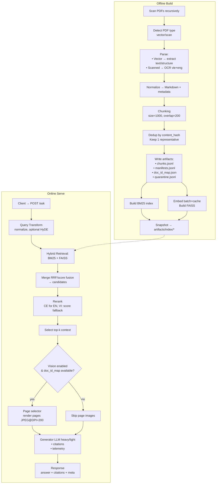
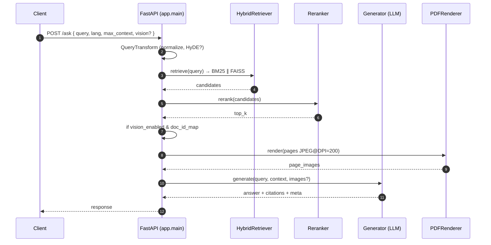
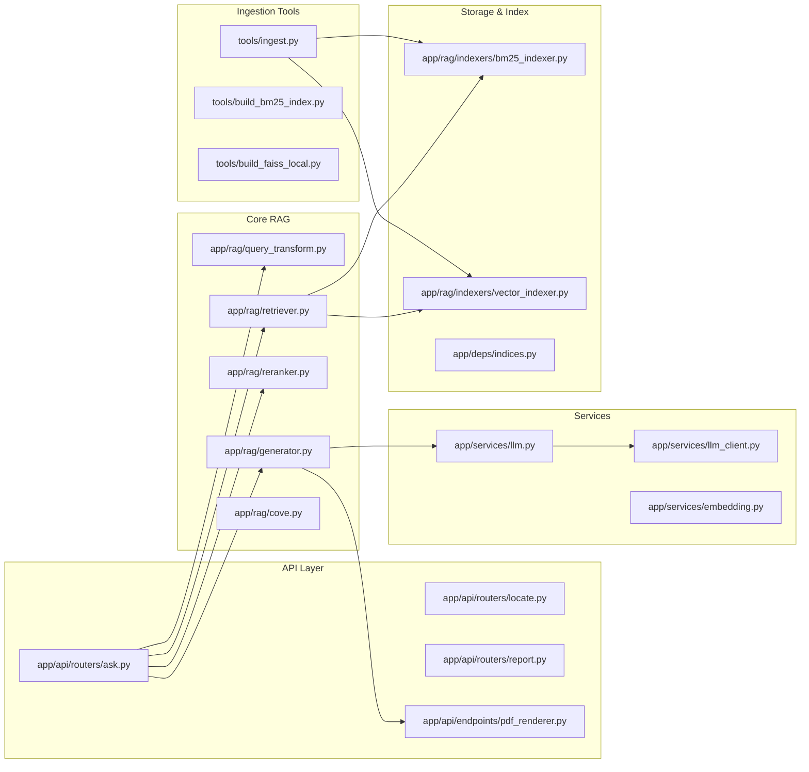

# PVCFC RAG — End‑to‑End Pipeline (Ingest → Index → Serve) (07/10/2025)

## Mục tiêu

- Trình bày pipeline tổng thể, chi tiết và rõ ràng cho toàn bộ dự án: từ ingest tài liệu → build chỉ mục → phục vụ truy vấn RAG (text + vision) → trích dẫn → báo cáo.
- Ánh xạ từng bước về module/file và artifacts sinh ra.

---

## Kiến trúc tổng quan

### Offline (Build)
Ingest PDF (vector/scan) → Normalize/Chunk → Dedup → Xuất artifacts → Build BM25 + FAISS.

### Online (Serve)
Nhận query → Query Transform/HyDE → Hybrid Retrieval (BM25 ∪ FAISS) → Rerank → Generation (LLM) → Citations (doc_id + page [+ pdf_path]) → Báo cáo (nếu yêu cầu).

---

## Sơ đồ luồng tổng (Mermaid)



---

## Pipeline chi tiết theo giai đoạn

### 1) Ingest & Index (Offline)

**Input**: PDF dưới `D:\Data_Raw` (quét đệ quy).

**Bước xử lý**:

1. **Detect** vector/scan.
2. **Parse**:
   - Vector → PyMuPDF
   - Scan → OCR (vie+eng, DPI tự điều chỉnh 300–600 khi cần)
3. **Normalize** → text Markdown + metadata trang.
4. **Chunking**: ký tự `size=1000`, `overlap=200` (configurable).
5. **Dedup**:
   - `file_hash`: duplicate file y hệt
   - `content_hash`: duplicate nội dung, giữ 1 đại diện
6. **Artifacts**:
   - `artifacts/ingestion/chunks/chunks.jsonl`
   - `artifacts/ingestion/doc_id_map.json` (map `doc_id → pdf_path`)
   - `artifacts/ingestion/quarantine.jsonl` (corrupt/password/ocr_failed/...)
7. **Build chỉ mục**:
   - BM25: `artifacts/index/bm25/*`
   - FAISS: embed (batch+cache SQLite theo `(model_id, dim, content_hash)`) → `artifacts/index/faiss/*`

**Công cụ CLI tham chiếu**:
- `tools/ingest.py`
- `tools/build_bm25_index.py`
- `tools/build_faiss_local.py`

**Module/File chính**:
- Ingest/CLI: `tools/ingest.py`, `scripts/run_ingest_v1.ps1`, `README.md` (mục Ingest/Build)
- Indexers: `app/rag/indexers/bm25_indexer.py`, `app/rag/indexers/vector_indexer.py` (FAISS), `app/deps/indices.py` (load/startup)

---

### 2) Khởi tạo hệ thống & nạp index (Startup)

**`app/main.py`**:
- Lifespan startup → `startup_indices(settings)` → nạp BM25/FAISS, khởi tạo `HybridRetriever`, lưu vào `app.state.retriever`
- Nạp `artifacts/ingestion/doc_id_map.json` nếu có, lưu `app.state.doc_id_map`
- Thêm middlewares: logging, tracing, rate-limit; CORS; metrics
- Include routers: `app/api/routers/{ask, locate, report}.py`, `app/api/endpoints/pdf_renderer.py`

**Module/File chính**:
- `app/deps/indices.py`
- `app/core/{config,logging,metrics,rate_limit,tracing}.py`

---

### 3) Truy vấn RAG (Online)

**Endpoint**: `POST /ask` (router: `app/api/routers/ask.py`)

**Luồng chi tiết**:

1. **Validate & log** (trace_id, timing breakdown)
2. **Query Transform**: normalize; tuỳ chọn HyDE (`QueryTransformer`)
3. **Hybrid Retrieval**:
   - BM25 search + FAISS search song song
   - Hợp nhất ứng viên (RRF/score fusion nội bộ)
4. **Rerank**:
   - Cross-Encoder (EN); với VI → fallback score-based để tránh NaN
   - Chọn `top_rerank` theo settings, sau đó lấy `max_context` cho generation
5. **Vision gating** (tuỳ chọn):
   - Điều kiện: settings cho phép và request không tắt; cần map `doc_id → pdf_path`
   - Page selector: từ metadata `page|page_start|page_end` → chọn <=10 trang; clamp 1-based; dedup (pdf_path,page)
   - Render nội bộ: JPEG @ DPI=200; lỗi trang → bỏ qua, ghi `pages_failed`
6. **Generation (LLM)**:
   - Tiers: `heavy` (`gemini-2.5-pro`, multimodal) / `light` (`gemini-2.5-flash`, text-only)
   - Trả `answer` + `citations` (doc_id + page [+ pdf_path]) + `meta` (latency breakdown, model, vision pages)

**Module/File chính**:
- Router: `app/api/routers/ask.py` (điều phối pipeline), `app/routers/ask.py` (biến thể cũ)
- RAG core: `app/rag/query_transform.py`, `app/rag/retriever.py`, `app/rag/reranker.py`, `app/rag/generator.py`, `app/rag/cove.py`
- Vision & render: `app/api/endpoints/pdf_renderer.py` (render trang on‑demand), doc_id map từ `app.main`
- LLM: `app/services/{llm, llm_client}.py` (routing model tiers, timeout/retry)

---

### 4) Locate (định vị trang) & Report (báo cáo)

**POST /locate**:
- Xác định trang liên quan từ query (không yêu cầu bbox V1)
- Router: `app/api/routers/locate.py`

**POST /report**:
- Tạo báo cáo tạm (Markdown/Docx) từ answer + citations
- Router: `app/api/routers/report.py`
- Kết quả: file markdown/docx đơn giản với tiêu đề, Q/A, citations, timestamp, trace

---

### 5) Observability, kiểm soát & vận hành

**Endpoints**:
- `/metrics` (Prometheus)
- `/trace`
- `/index-stats`
- `/docs` | `/redoc` (non‑prod)

**Middlewares**:
- `LoggingMiddleware`
- `TracingMiddleware`
- `RateLimitMiddleware`

**Logs**:
- Model routing
- Vision gating
- pages_used/pages_failed
- timing_by_stage

**Giới hạn tài nguyên**:
- Batch/concurrency embedding
- Giảm `k_*` khi query nếu cần

---

## Artifacts & thư mục dữ liệu

### `artifacts/ingestion/`
- `chunks/chunks.jsonl`
- `doc_id_map.json`
- `quarantine.jsonl`

### `artifacts/index/`
- `bm25/*`
- `faiss/*`
- `metadata.json`

### `artifacts/pdf/`
- (nếu cache render trang, tuỳ cấu hình; mặc định render on‑the‑fly)

---

## Cấu hình quan trọng (`.env`/settings)

### LLM
```env
LLM_PROVIDER=gemini
LLM_MODEL_HEAVY=gemini-2.5-pro
LLM_MODEL_LIGHT=gemini-2.5-flash
```

### Embedding
```env
EMBEDDING_PROVIDER=gemini
EMBEDDING_MODEL=gemini-embedding-001  # auto-detect dim
EMBED_BATCH_SIZE=256
EMBED_CONCURRENCY=8
```

### Vision
```env
VISION_MAX_PAGES_TOTAL=10
PDF_RENDER_DPI=200
PDF_IMAGE_FORMAT=jpeg
```

### App
```env
APP_ENV=local
API_PORT=8000
LOG_LEVEL=INFO
```

---

## Sơ đồ tuần tự (Online /ask)



---

## Ghi chú & khác biệt quan trọng

- **Rerank**: CE chỉ cho EN; VI dùng score fallback để tránh NaN.
- **Citations**: luôn doc_id + page (1-based); thêm `pdf_path` nếu có `doc_id_map.json`.
- **Endpoint thực tế theo code**: `/ask`, `/locate`, `/report`, `/api/pdf/*`; monitoring: `/metrics`, `/trace`, `/index-stats`.
- **Vision**: không phải verify pipeline riêng; chỉ tăng độ chính xác khi có trang liên quan.

---

## Sơ đồ kiến trúc module



---

## Workflow chi tiết: Từ PDF đến Answer

### Phase 1: Offline Processing

```
PDF Files (D:\Data_Raw)
    ↓
[DocumentDetector] → Detect vector/scan
    ↓
[VectorExtractor/OCRExtractor] → Extract text + structure
    ↓
[TextNormalizer] → Clean & normalize
    ↓
[MarkdownConverter] → Convert to Markdown
    ↓
[HierarchicalChunker] → Create chunks (1000/200)
    ↓
[DedupService] → Dedup by content_hash
    ↓
[ManifestWriter] → Write chunks.jsonl, doc_id_map.json
    ↓
├─→ [BM25Indexer] → Build keyword index
└─→ [VectorIndexer + EmbeddingService] → Build semantic index
    ↓
artifacts/index/{bm25, faiss}
```

### Phase 2: Online Serving

```
User Query
    ↓
[QueryTransformer] → Normalize, optional HyDE
    ↓
[HybridRetriever]
    ├─→ BM25 search (keyword)
    └─→ FAISS search (semantic)
    ↓
[Merge] → RRF/score fusion
    ↓
[Reranker] → Cross-Encoder (EN) or score-based (VI)
    ↓
[Top-K Selection] → Select max_context chunks
    ↓
[Vision Gate?]
    ├─→ YES: [PageSelector] → render pages → JPEG
    └─→ NO: Skip
    ↓
[ResponseGenerator]
    ├─→ Build prompt with context (+images if vision)
    ├─→ Call LLM (heavy/light tier)
    └─→ Extract citations (doc_id + page)
    ↓
[Response] → answer + citations + meta
    ↓
User receives answer with page-level citations
```

---

## Tài liệu tham chiếu trong repo

### Tổng quan & README
- `README.md` (mục 3, 4, 6, 7, 8, 12)

### Phase 1: Ingest & Index
- `Build_plan_README/roadmap/Build_plan_phase_1.md`
- `docs/DOCS_PHASE1/phase1_implementation_summary.md`
- `docs/DOCS_PHASE1/TECH_DESIGN_INGEST_AND_VISION.md`
- `docs/DOCS_PHASE1/Phase1_Gap_Completion_Plan.md`

### Phase 2: RAG Pipeline & API
- `Build_plan_README/roadmap/Build_plan_phase_2.md`
- `docs/DOCS_PHASE2/phase2_implementation_roadmap.md`

### Common & Developer Docs
- `docs/DOCS_COMMON/Developer_Handbook.md`
- `docs/PROJECT_REPORTS/P2_STORAGE_COMPLETE.md`

### Mã nguồn chính
- Entry point: `app/main.py`
- API routers: `app/api/routers/*`
- RAG core: `app/rag/*`
- Services: `app/services/*`
- Dependencies: `app/deps/indices.py`

---

## Ví dụ request/response

### POST /ask

**Request**:
```json
{
  "query": "Áp suất vận hành tối đa của K06101?",
  "language": "vi",
  "max_context": 8,
  "enable_vision_generation": true,
  "hyde": false,
  "execution_mode": "production"
}
```

**Response**:
```json
{
  "answer": "Áp suất vận hành tối đa của thiết bị K06101 là 16 bar (theo manual trang 45).",
  "citations": [
    {
      "doc_id": "DOCID_abc123",
      "page": 45,
      "pdf_path": "D:\\Data_Raw\\Equipment\\K06101_Manual.pdf",
      "confidence": 0.95,
      "snippet": "Maximum operating pressure: 16 bar at 150°C"
    }
  ],
  "confidence": 0.89,
  "meta": {
    "model": "gemini-2.5-pro",
    "latency_ms": 1430,
    "breakdown": {
      "transform_ms": 120,
      "retrieve_ms": 450,
      "rerank_ms": 280,
      "generate_ms": 580
    },
    "k": 8,
    "execution_mode": "production",
    "trace_id": "xyz789",
    "vision_generation": {
      "enabled": true,
      "pages_used": [
        {
          "pdf_path": "D:\\Data_Raw\\Equipment\\K06101_Manual.pdf",
          "page": 45
        }
      ],
      "pages_failed": [],
      "excerpts": []
    }
  }
}
```

---

## Các tính năng nổi bật của pipeline

### 1. Hybrid Search
- Kết hợp BM25 (keyword) và FAISS (semantic)
- RRF (Reciprocal Rank Fusion) cho merge
- Rerank với Cross-Encoder (EN) hoặc score-based (VI)

### 2. Vision-Enhanced Generation
- Tự động render trang PDF liên quan
- Gửi kèm ảnh trang cho Gemini 2.5 Pro
- Tăng độ chính xác cho câu hỏi về bảng, biểu đồ, layout phức tạp

### 3. Page-Level Citations
- Trích dẫn chính xác đến trang (1-based)
- Map doc_id → pdf_path để dễ kiểm chứng
- Hỗ trợ render trang on-demand

### 4. Deduplication
- File-level: SHA256 hash
- Content-level: SHA1 normalized text
- Giữ 1 đại diện tốt nhất (vector > scan > size > mtime > path ngắn)

### 5. OCR Thông minh
- Chỉ OCR khi PDF scan (không có text layer)
- Đa ngôn ngữ: vie+eng
- DPI adaptive: 300–600 tùy chất lượng trang

### 6. Observability
- Tracing với trace_id xuyên suốt pipeline
- Metrics Prometheus
- Timing breakdown chi tiết từng stage
- Logs structured JSON

---

## Lộ trình mở rộng (Future Work)

### V1.1 - Office Documents
- Hỗ trợ docx, xlsx, pptx
- Extract tables từ Excel
- Convert PowerPoint slides

### V1.2 - Advanced Chunking
- Token-based chunking (thay vì character-based)
- Semantic chunking với sentence embeddings
- Table-aware chunking

### V1.3 - Bbox Highlighting
- Trả về bounding box cho text snippets
- Frontend highlight trực tiếp trên PDF

### V1.4 - Production Scale
- FAISS IVF-PQ cho millions vectors
- Distributed indexing
- Redis cache cho embeddings

### V1.5 - Advanced Features
- Multi-hop reasoning
- Comparative questions (so sánh nhiều tài liệu)
- Time-aware search (version control)

---

## Kết luận

Pipeline PVCFC RAG được thiết kế để:
- ✅ **Tin cậy**: Citations chính xác đến trang, dedup chặt chẽ
- ✅ **Thông minh**: Hybrid search + rerank + vision-enhanced generation
- ✅ **Hiệu quả**: Batch processing, caching, RAM guard ≤12GB
- ✅ **Mở rộng**: Kiến trúc module hóa, dễ thêm features mới
- ✅ **Quan sát được**: Tracing, metrics, logs chi tiết

Hệ thống đã sẵn sàng phục vụ tra cứu tài liệu kỹ thuật PVCFC với độ chính xác cao!
