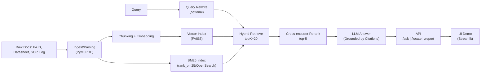

# PVCFC LLM API – RAG with P&ID Citations (Pilot: Compressor K‑101 - đây là tên ví dụ cho 1 máy nén, máy nén thưc tế sẽ có tên khac, project có thể mở rộng ra nhiều data hơn)

> **Mục tiêu**: Xây dựng nền tảng API dựa trên LLM + RAG để **truy xuất, tóm tắt và trích dẫn có kiểm chứng** từ kho tài liệu kỹ thuật PVCFC (ưu tiên P&ID PDF vector), trước tiên **thí điểm cho thiết bị Compressor K‑101**. Nền tảng hỗ trợ 3 API chính: `/ask`, `/locate`, `/report`, có **UI demo** để kiểm thử và đánh giá theo **KPI định lượng**.

**TL;DR**
- **Kiến trúc**: Ingest → Chunk → Embed → **Hybrid Retrieval (BM25 + Vector)** → **Cross‑encoder Rerank** → LLM **sinh đáp án có trích dẫn** (Doc_ID;Trang;bbox).  
- **Dữ liệu ưu tiên**: P&ID PDF **vector** (có text layer + bbox), datasheet, SOP; Excel log làm đối chiếu.  
- **Pilot**: Thiết bị **K‑101**, đảm bảo tính đúng đắn, có kiểm chứng bằng trích dẫn.  
- **KPI mục tiêu**: `AcceptableAnswer ≥ 0.80`, `CitationCoverage ≥ 0.95`, `P@5 ≥ 0.85`.  
- **Lộ trình theo PHA** (tối ưu cho Warp & Cursor): build dần, **dễ debug, dễ triển khai**.

---

## 1) Phạm vi & Giới hạn (MVP)
**In‑scope**
- P&ID PDF **vector** (text layer + bbox), Datasheet, SOP, một số Excel log của **K‑101**.
- 3 endpoint: **`/ask`** (Q&A có citation), **`/locate`** (định vị tag/bbox trên P&ID), **`/report`** (sinh báo cáo).  
- **UI demo** (Streamlit) để kiểm thử & chuyển giao.  
- **Đánh giá KPI** bằng **Golden Set 100 câu** & rubric SME.  

**Out‑of‑scope** (MVP)
- Nhận dạng hình học P&ID (đường ống/symbol) ở mức computer vision.  
- Bảo mật doanh nghiệp nâng cao (SSO/LDAP/ABAC); dùng **bảo mật tối thiểu** với `.env`, phân quyền file, logging.  
- Tích hợp realtime với DCS/PLC.  

---

## 2) Kiến trúc tổng quan



**Chuẩn citation** (tọa độ P&ID):
```json
{
  "doc_id": "PFD-PID-K101-001",
  "page": 3,
  "bbox": [x0, y0, x1, y1],
  "text": "Tag/Ký hiệu trích dẫn"
}
```

---

## 3) Cấu trúc repo đề xuất
```
.
├── app/
│   ├── api/                # FastAPI endpoints: /ask, /locate, /report, /healthz
│   ├── core/               # retrieval.py, rerank.py, llm.py, prompts.py
│   ├── ingest/             # pid_parser.py, datasheet_parser.py, sop_parser.py
│   ├── indexing/           # build_index.py (FAISS, BM25), schema.py
│   ├── eval/               # golden_set.csv, evaluate.py, metrics.py, reports/
│   └── ui/                 # streamlit_app.py (demo)
├── data/
│   ├── raw/                # tài liệu gốc (P&ID, SOP, datasheet, log)
│   ├── processed/          # jsonl chunk, bbox map
│   └── index/              # faiss.index, bm25_store.pkl, meta.sqlite
├── configs/
│   ├── settings.yaml       # cấu hình chung
│   └── prompts.yaml        # prompt mẫu (LLM)
├── scripts/
│   ├── dev_bootstrap.sh    # tạo venv, cài deps, pre-commit
│   ├── ingest_demo.sh      # ingest & index mẫu
│   └── run_ui.sh           # chạy UI
├── tests/                  # unit/integration tests
├── .env.example
├── pyproject.toml / requirements.txt
├── Makefile
└── README.md
```

---

## 4) Cài đặt & Chạy nhanh (Warp/Cursor friendly)

### 4.1 Yêu cầu
- **Python 3.11**
- (Tùy chọn) **uv** hoặc **pip**; **FAISS** build cho nền tảng của bạn
- (Tùy chọn) **OpenSearch**/**ElasticSearch** nếu muốn BM25 ở quy mô lớn (MVP dùng `rank_bm25`)

### 4.2 Biến môi trường (`.env.example`)
```bash
# LLM
LLM_PROVIDER=openai          # hoặc anthropic, azure, ...
OPENAI_API_KEY=sk-...
ANTHROPIC_API_KEY=...
LLM_MODEL=gpt-4o-mini        # hoặc tương đương

# Retrieval
EMBEDDING_MODEL=sentence-transformers/all-MiniLM-L6-v2
CROSS_ENCODER_MODEL=cross-encoder/ms-marco-MiniLM-L-6-v2
TOPK_RETRIEVE=20
TOPK_RERANK=5

# Paths
DATA_RAW=./data/raw
DATA_PROCESSED=./data/processed
DATA_INDEX=./data/index

# Server
API_HOST=0.0.0.0
API_PORT=8000
```

### 4.3 Lệnh nhanh (Makefile gợi ý)
```makefile
install:
	uv venv || python -m venv .venv
	. .venv/bin/activate && pip install -r requirements.txt

ingest-demo:
	. .venv/bin/activate && python app/indexing/build_index.py --demo

api:
	. .venv/bin/activate && uvicorn app.api.main:app --host $${API_HOST:-0.0.0.0} --port $${API_PORT:-8000} --reload

ui:
	. .venv/bin/activate && streamlit run app/ui/streamlit_app.py

eval:
	. .venv/bin/activate && python app/eval/evaluate.py --gold app/eval/golden_set.csv --run outputs/eval_$$RANDOM.json
```

---

## 5) Đặc tả API (OpenAPI stub)
```yaml
openapi: 3.0.3
info:
  title: PVCFC LLM API
  version: 0.1.0
servers:
  - url: http://localhost:8000
paths:
  /healthz:
    get:
      summary: Health check
      responses: { "200": { "description": "ok" } }
  /ask:
    post:
      summary: Q&A có trích dẫn
      requestBody:
        required: true
        content:
          application/json:
            schema:
              type: object
              properties:
                query: { type: string }
                topk: { type: integer, default: 20 }
                rerank_k: { type: integer, default: 5 }
      responses:
        "200":
          description: OK
          content:
            application/json:
              schema:
                type: object
                properties:
                  answer: { type: string }
                  citations:
                    type: array
                    items:
                      type: object
                      properties:
                        doc_id: { type: string }
                        page: { type: integer }
                        bbox: { type: array, items: { type: number } }
                        text: { type: string }
  /locate:
    post:
      summary: Định vị tag/ký hiệu trên P&ID
      requestBody:
        required: true
        content:
          application/json:
            schema:
              type: object
              properties:
                tag: { type: string }
      responses: { "200": { description: OK } }
  /report:
    post:
      summary: Sinh báo cáo tự động có citation
      requestBody:
        required: true
        content:
          application/json:
            schema:
              type: object
              properties:
                template: { type: string, example: "k101_summary" }
                params: { type: object }
      responses: { "200": { description: OK } }
```

---

## 6) Mô hình dữ liệu (schema)

**Chunk**
```json
{
  "chunk_id": "PID-K101-001_p3_0001",
  "doc_id": "PFD-PID-K101-001",
  "page": 3,
  "text": "Nội dung văn bản...",
  "bbox": [0,0,100,100],
  "embedding": "FAISS:offset",
  "meta": { "revision": "R0", "source": "P&ID" }
}
```

**Tag Dictionary**
```json
{ "tag": "K-101", "alias": ["K101","COMP-K101"], "regex": "(?i)\b(K[\-\s]?101|COMP[\-\s]?K[\-\s]?101)\b" }
```

**Citation**
```json
{ "doc_id": "DS-K101-001", "page": 2, "bbox": null, "text": "áp suất làm việc ..." }
```

---

## 7) Build Plan theo **PHA** (dễ debug, dễ triển khai)

### **PHA 0 – Bootstrap**
- **Mục tiêu**: Khởi tạo repo, môi trường, khung API & thư mục; script dev.
- **Nhiệm vụ**  
  - Tạo `pyproject.toml` / `requirements.txt` (fastapi, uvicorn, pydantic, pymupdf, faiss-cpu, rank_bm25, sentence-transformers, streamlit, python-dotenv).  
  - Tạo `app/api/main.py` với `/healthz`.  
  - Tạo `scripts/dev_bootstrap.sh`, `Makefile`, `.env.example`.  
- **Chấp nhận**: `make api` chạy `/healthz=ok`.

> **Cursor Taskcard**: _"Generate FastAPI skeleton with /healthz in app/api/main.py and project tree above."_

---

### **PHA 1 – RAG Core (Baseline)**
- **Mục tiêu**: Ingest P&ID (pdf vector), datasheet, SOP → chunk, embed → **index v0.1**; `/ask` baseline.
- **Nhiệm vụ**
  - `app/ingest/pid_parser.py` (PyMuPDF đọc text+bbox).  
  - `app/indexing/build_index.py` (FAISS + rank_bm25, lưu meta).  
  - `app/core/retrieval.py` (hybrid retrieve), `app/core/llm.py` (call provider), `app/core/prompts.py`.  
  - `app/api/ask.py` và mount vào `main.py`.  
- **Chấp nhận**: `/ask` trả lời 10 query mẫu, **kèm citation đúng Doc_ID;Trang**.

> **Warp**: `make ingest-demo` → `make api` → thử POST `/ask` bằng `curl`/`httpie`.

---

### **PHA 2 – `/locate` + `/report` + UI Demo**
- **Mục tiêu**: Trả về **bbox** cho tag/ký hiệu; sinh báo cáo tóm tắt **K‑101**; UI demo.
- **Nhiệm vụ**
  - `app/api/locate.py`: lookup BM25/regex từ Tag Dictionary → trả `page + bbox`.  
  - `app/api/report.py`: ghép dữ liệu từ datasheet/SOP → `docx/pdf` (Jinja2/docxtpl).  
  - `app/ui/streamlit_app.py`: nhập câu hỏi, hiển thị citation, **click mở PDF tại bbox**.  
- **Chấp nhận**: UI demo chạy, `/locate` trả đúng **5 ảnh overlay** minh hoạ.

---

### **PHA 3 – Đánh giá & Tối ưu chất lượng**
- **Mục tiêu**: KPI **đạt mục tiêu** trên Golden Set 100 câu.
- **Nhiệm vụ**
  - `app/eval/golden_set.csv` (chuẩn hoá 100 câu).  
  - `app/eval/evaluate.py` (chấm AcceptableAnswer, CitationCoverage, P@5).  
  - Thử nghiệm: `chunk window/overlap`, `topK`, nhiều **cross‑encoder** khác nhau → **A/B reports**.  
- **Chấp nhận**: `AcceptableAnswer ≥ 0.80`, `CitationCoverage ≥ 0.95`, `P@5 ≥ 0.85`.

---

### **PHA 4 – Đóng gói & Chuyển giao**
- **Mục tiêu**: Tài liệu hóa, hướng dẫn vận hành, bảo mật tối thiểu; báo cáo & video.
- **Nhiệm vụ**
  - `docs/` (hướng dẫn cài đặt, runbook, checklist bảo mật).  
  - Script đóng gói artifacts, **Index versioning** (`index_v0.1`, `v0.2`, …).  
- **Chấp nhận**: Báo cáo cuối kỳ 70–80 trang, slide, video demo 3–5 phút.

---

## 8) Đánh giá & KPI

**Định nghĩa**  
- **AcceptableAnswer**: SME đánh dấu **1/0** trên rubric: nội dung đúng, đủ, **có citation hợp lệ** (Doc_ID;Trang;bbox nếu P&ID).  
- **CitationCoverage**: tỷ lệ câu trả lời **có ≥1 citation hợp lệ**.  
- **P@5**: Trong top‑5 kết quả retrieved (trước LLM), **có chứa bằng chứng** cho câu trả lời.  

**Quy trình**  
1. Chạy `app/eval/evaluate.py` với `golden_set.csv`.  
2. Xuất `outputs/eval_run.json` + bảng tổng hợp KPI; lưu **version index** và cấu hình.  

---

## 9) Bảo mật & Vận hành (MVP)
- Không commit `.env`; cung cấp `.env.example`.  
- Phân quyền đọc cho thư mục `data/raw`.  
- Bật logging (request id, latency, lỗi LLM).  
- Ghi **audit trail** khi người dùng click citation mở PDF.  

---

## 10) Tiêu chuẩn code & CI
- **Pre‑commit**: black, isort, ruff.  
- **Tests**: pytest (unit), integration tests cho `/ask`, `/locate`.  
- **Conventional Commits** + CHANGELOG.  
- (Tùy chọn) GitHub Actions: lint, test, build image.  

---

## 11) Cookbook debug nhanh
- **Không thấy text/bbox từ P&ID** → file raster; cần OCR fallback hoặc đổi nguồn vector.  
- **/ask không có citation** → kiểm tra schema chunk có doc_id/page; tăng `TOPK_RETRIEVE`; bật rerank.  
- **/locate sai trang/bbox** → kiểm tra Tag Dictionary (regex/alias); xem normalize tiền xử lý.  
- **FAISS lỗi build** → dùng `faiss-cpu` phù hợp nền tảng; fallback `sklearn NearestNeighbors` (tạm).  

---

## 12) Prompt mẫu (LLM – đảm bảo citation)
```text
SYSTEM: You are a retrieval-grounded assistant. Answer ONLY using the provided context chunks.
- Cite sources with: Doc_ID;Page;BBox(optional). 
- If missing evidence, say "Không đủ căn cứ trong tài liệu." Do NOT hallucinate.

USER QUERY: ${query}

CONTEXT (top-5 reranked chunks):
[Doc_ID=${doc_id}, Page=${page}, BBox=${bbox}]
${chunk_text}
...
RESPONSE FORMAT (JSON):
{"answer": "...", "citations": [{"doc_id":"...", "page":N, "bbox":[x0,y0,x1,y1]}]}
```

---

## 13) Checklist bàn giao
- [ ] `/ask`, `/locate`, `/report` hoạt động trên **Index v0.x**.  
- [ ] Golden Set 100 câu + báo cáo KPI đạt mục tiêu.  
- [ ] UI demo có **click citation → mở PDF tại bbox**.  
- [ ] Runbook vận hành + checklist bảo mật.  
- [ ] Báo cáo + slide + video demo.  

---

## 14) Phần cần bạn xác nhận thêm (tuỳ chọn)
- LLM provider & model cụ thể (OpenAI/Azure/Anthropic/Local).  
- Quy mô dữ liệu ban đầu (số file P&ID, datasheet, SOP) để chọn BM25 in‑memory hay OpenSearch.  
- Mẫu report (DOCX/PDF) mong muốn cho `/report`.  
- Yêu cầu đóng gói (Docker/K8s) và hạ tầng triển khai.
